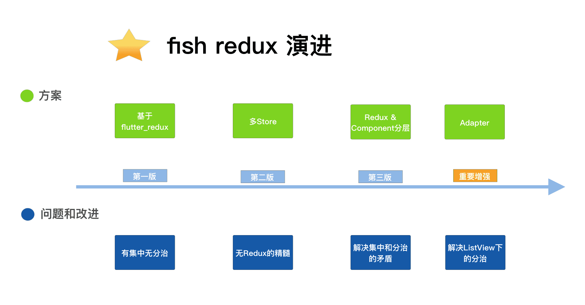
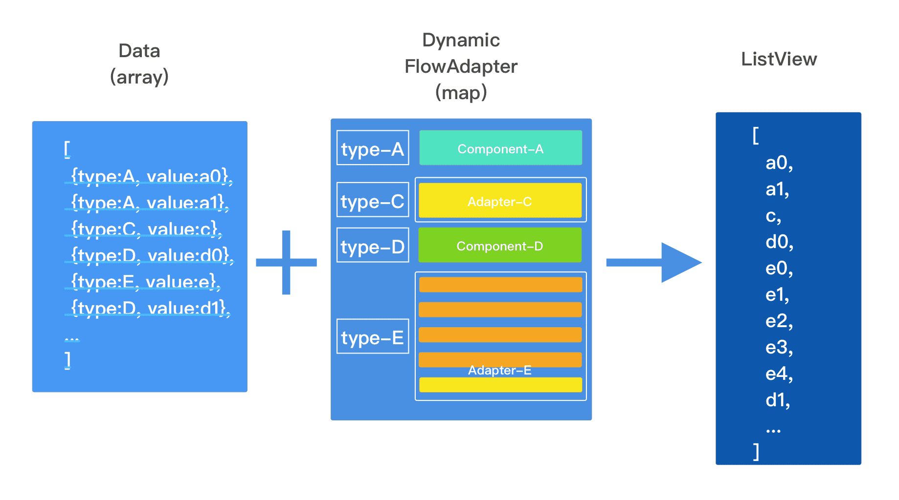
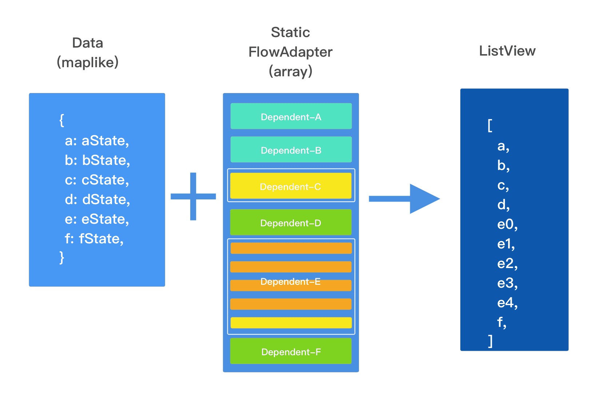

### 前言

借助于 Redux， Elm， Dva，Fish Redux 站在巨人的肩膀上，将集中，分治，复用，隔离做的更进一步。
配置式组装。 一方面我们将一个大的页面，对视图和数据层层拆解为互相独立的 Component|Adapter，上层负责组装，下层负责实现； 另一方面将 Component|Adapter 拆分为 View，Reducer，Effect 等相互独立的上下文无关函数。

#### 直接使用 flutter 会面临的问题？
    1. 数据流问题
        目前社区流行的数据流方案有： 单向数据流方案，以 Redux 为代表 响应式数据流方案，以 Mobx 为代表 其他，以 rxjs 为代表 那么哪一种架构最合适 flutter ？ 我们追随了 javascript 栈绝大多数开发者的选择 - ReduxJs 感谢 ReduxJs，我们是几乎 100%的还原了它在 dart 上的实现。所以我们也继承了它的优点：[Predictable],[Centralized],[Debuggable],[Flexible]。
    2. 页面间通信问题
        直接使用 flutter，在 Widgets 之间传递状态和回调，随着应用复杂度的上升，会变成是一件可怕而糟糕的事情。 通过 fish redux，依托于集中的 Redux 和分治的 Effect 模块，通过一个极简的 dispatch-api，完成所有的通信的诉求。
    3. 可插拔的组件系统
        fish redux 通过一个配置式的 Dependencies，来完成灵活的可插拔的组件系统。同时有这一配置的存在，它解放了我们手动拼装 Reducer 的繁琐工作。 
    4. 展示和逻辑解耦
       fish redux 从 elm 中得到了非常多的设计灵感。 将一个组件，拆分为相互独立的 View，Effect，Reducer 三个函数，我们优雅的解决了展示和逻辑解耦的问题。 通过这样的拆分，我们将 UI 的表达隔离于一个函数内，它让我们更好的面向未来，一份 UI 表达它可能来自于开发者，可能来自于深度学习框架的 UI 代码生成，可能是面向移动终端，也可能是面向浏览器。它让我们有了更多的组合的可能。 同时函数式的编程模型带来了更容易编写，更容易扩展，更容易测试，更容易维护等特性。
    5. 统一的编程模型和规范
       sample_page
        -- action.dart /// define action types and action creator
        -- page.dart /// config a page or component
        -- view.dart /// define a function which expresses the presentation of user interface
        -- effect.dart /// define a function which handles the side-effect
        -- reducer.dart /// define a function which handles state-change
        -- state.dart /// define a state and some connector of substate
        components
            sample_component
            -- action.dart
            -- component.dart
            -- view.dart
            -- effect.dart
            -- reducer.dart
            -- state.dart


### fish-redux 演进


1. 基于flutter_redux进行的改造，核心是提供了 UI 代码的组件化，但针对复杂的业务场景，往往业务逻辑很多，无法做到逻辑代码的分治和复用。
2. 第三个版本进行重构时，确立了整体的架构原则与分层要求，一方面按照 reduxjs 的代码进行了 flutter 侧的 redux 实现，将 redux 完整保留下来。另一方面针对组件化的问题，提供了 redux 之上的 component 的封装，并创新的通过这一层的架构设计提供了业务代码分治的能力。
3. 第三版 完成了 Redux， Component 两层的设计，其中包含了 Connector，Dependencies，Context 等重要概念。


##### Connector
解决集中和分治的矛盾的核心, combineReducers 是一个将 Reducer 分治的函数，让一个庞大数据的 Reducer 可以由多层的更小的 Reducer 组合而成。
```dart
let hasChanged = false;
const nextState = {};
for (let i = 0; i < finalReducerKeys.length; i++) {
	const key = finalReducerKeys[i];
	const reducer = finalReducers[key];
	const previousStateForKey = state[key];
	const nextStateForKey = reducer(previousStateForKey, action);
	if (typeof nextStateForKey === 'undefined') {
		const errorMessage = getUndefinedStateErrorMessage(key, action);
		throw new Error(errorMessage);
	}
	nextState[key] = nextStateForKey;
	hasChanged = hasChanged || nextStateForKey !== previousStateForKey;
}
return hasChanged ? nextState : state;
```
有非常明显的语言的局限性，如下 3 点:

    浅拷贝一个任意对象
    const nextState = {};
    读取字段
    const previousStateForKey = state[key];
    写入字段
    nextState[key] = nextStateForKey;
- State 的 clone 的能力（浅拷贝）
- Get & Set 的能力，即为 Connector 的概念。


##### Dependencies
这一层的组件的分治是面向通用设计的。通过在 Dependencies 配置 slots，得到了可插拔的组件系统。


##### Adapter
-   在基础 Component 的概念外，额外增加了一种组件化的抽象 Adapter。它的目标是解决 Component 模型在 ListView 的场景下的 3 个问题
    -  将一个"Big-Cell"放在 ListView 里，无法享受 ListView 代码的性能优化。
    -  Component 无法区分 appear|disappear 和 init|dispose 事件。
    -  Effect 的生命周期和 View 的耦合，在 ListView 的有些场景下不符合直观的预期。
-   一个 Adapter 和 Component 几乎都是一致的，除了以下几点
    -   Component 生成一个 Widget，Adapter 生成一个 ListAdapter，ListAdapter 有能力生成一组 Widget。
        -   不具体生成 Widget，而是一个 ListAdapter，能非常大的提升页面帧率和流畅度。
    -   Effect-Lifecycle-Promote
        -   Component 的 Effect 是跟着 Widget 的生命周期走的，Adapter 的 Effect 是跟着上一级的 Widget 的生命周期走。
        -   Effect​ 提升，极大的解除了业务逻辑和视图生命的耦合，即使它的展示还未出现，的其他模块依然能通过 dispatch-api，调用它的能力。
    -   appear|disappear 的通知
        -   由于 Effect 生命周期的提升，我们就能更加精细的区分 init|dispose 和 appear|disappear。而这在 Component 的模型中是无法区分的。
    -   Reducer is long-lived, Effect is medium-lived, View is short-lived.


Adapter三种实现

1. DynamicFlowAdapter (eg: Map，接受一个数组类型的数据驱动)
```dart
class RecommendAdapter extends DynamicFlowAdapter<RecommendState> {
    RecommendAdapter()
        : super(
            pool: <String, Component<Object>>{
                'card_0': RecommendTitleComponent(),
                'card_1': RecommendRowComponent(),
            },
            connector: RecommendCardListConnector(),
        );
}
```


2. StaticFlowAdapter (eg: Array，接受 Object|Map 的数据驱动。接收一个 Dependent 的数组，每一个 Dependent 可以是 Component 或者 Adapter + Connector<T,P> 的组合。非常的像是一个 flatMap + compact 的操作。)
```dart
class ItemBodyComponent extends Component<ItemBodyState> {
    ItemBodyComponent()
        : super(
            view: buildItemBody,
            dependencies: Dependencies<ItemBodyState>(
            adapter: StaticFlowAdapter<ItemBodyState>(
                slots: <Dependent<ItemBodyState>>[
                    VideoAdapter().asDependent(videoConnector()),
                    UserInfoComponent().asDependent(userInfoConnector()),
                    DescComponent().asDependent(descConnector()),
                    ItemImageComponent().asDependent(itemImageConnector()),
                    OriginDescComponent().asDependent(originDescConnector()),
                    VisitComponent().asDependent(visitConnector()),
                    SameMoreComponent().asDependent(sameMoreConnector()),
                    PondComponent().asDependent(pondConnector()),
                    CommentAdapter().asDependent(commentConnector()),
                    RecommendAdapter().asDependent(recommendConnector()),
                    PaddingComponent().asDependent(paddingConnector()),
                ]),
            ),
        );
}
```



3. CustomAdapter (对大 Cell 的自定义实现。要素和 Component 类似，不一样的地方是 Adapter 的视图部分返回的是一个 ListAdapter)
```dart
class CommentAdapter extends Adapter<CommentState> {
    CommentAdapter()
        : super(
            adapter: buildCommentAdapter,
            effect: buildCommentEffect(),
            reducer: buildCommentReducer(),
        );
}

ListAdapter buildCommentAdapter(CommentState state, Dispatch dispatch, ViewService service) {
    final List<IndexedWidgetBuilder> builders = Collections.compact(<IndexedWidgetBuilder>[]
    ..add((BuildContext buildContext, int index) =>
        _buildDetailCommentHeader(state, dispatch, service))
    ..addAll(_buildCommentViewList(state, dispatch, service))
    ..add(isEmpty(state.commentListRes?.items)
        ? (BuildContext buildContext, int index) =>
            _buildDetailCommentEmpty(state.itemInfo, dispatch)
        : null)
    ..add(state.commentListRes?.getHasMore() == true
        ? (BuildContext buildContext, int index) => _buildLoadMore(dispatch)
        : null));
    return ListAdapter(
    (BuildContext buildContext, int index) =>
        builders[index](buildContext, index),
    builders.length,
    );
}
```
4. 面向 ListView 场景的分治设计 Adapter，解决了在面向 ListView 场景下的逻辑的分治和性能降低的矛盾。

一般框架对 ListView 的分治是怎么做的。传统的手段，我们对 ListView 的分治更多的局限于它展现部分，而它的逻辑部分往往是集中的。而当我们试图将 ListView 下的某一局部的展现和逻辑封装在一起，我们就会遇到"Big-Cell"问题，面临性能的显著降低。 这里面存在一个分治和性能上的矛盾。这个矛盾带来了复用难，可维护差，难以协作等中大型场景下的问题。

解决这个问题，有两种思路，fish-redux选择后者：
1. 下沉到 UI 表达层（Widgets），去实现一个高性能的 ScrollView。
2. 向上做模型抽象，得到一个逻辑上的 ScrollView，性能上的 ListView。

一个 ListView 对应了一个 Adapter
1. 一个 Adapter 是可以由多个 Component 和 Adapter 组合而成，它有点像 flatmap & compact 的 api 的叠加。
2. Adapter 以及它的子 Adapter 的生命周期是和 ListView 是等效的。它像跨斗一般附着于 ListView 的生命周期之上。同时由于 Adapter 生命周期的提升，我们额外收获了两个非常有用的事件消息(appear & disappear)。
3. 在 Adapter 里配置的子 Component，它的生命周期和它所对应的 WidgetState 是一致的，所以它的是短暂的。


##### Dependencies

Dependencies 是一个表达组件之间依赖关系的结构。它接收两个字段 slots （ <String, Dependent>{} ），以及adapter

主要包含三方面的信息,一个 组件的 Reducer 由 Component 自身配置的 Reducer 和它的 Dependencies 下的所有子 Reducers 自动复合而成。
- slots，组件依赖的插槽。
- adapter，组件依赖的具体适配器（用来构建高性能的 ListView）。
- Dependent 是 subComponent | subAdapter + connector 的组合。

```dart
class ItemComponent extends ItemComponent<ItemState> {
  ItemComponent()
      : super(
          view: buildItemView,
          reducer: buildItemReducer(),
          dependencies: Dependencies<ItemState>(
            slots: <String, Dependent<ItemState>>{
              'appBar': AppBarComponent().asDependent(AppBarConnector()),
              'body': ItemBodyComponent().asDependent(ItemBodyConnector()),
              'ad_ball': ADBallComponent().asDependent(ADBallConnector()),
              'bottomBar': BottomBarComponent().asDependent(BottomBarConnector()),
            },
          ),
        );
}

///call in view
Widget buildItemView(ItemState state, Dispatch dispatch, ViewService service) {
  return Scaffold(
      body: Stack(
        children: <Widget>[
          service.buildComponent('body'),
          service.buildComponent('ad_ball'),
          Positioned(
            child: service.buildComponent('bottomBar'),
            left: 0.0,
            bottom: 0.0,
            right: 0.0,
            height: 100.0,
          ),
        ],
      ),
      appBar: AppbarPreferSize(child: service.buildComponent('appBar')));
}
```