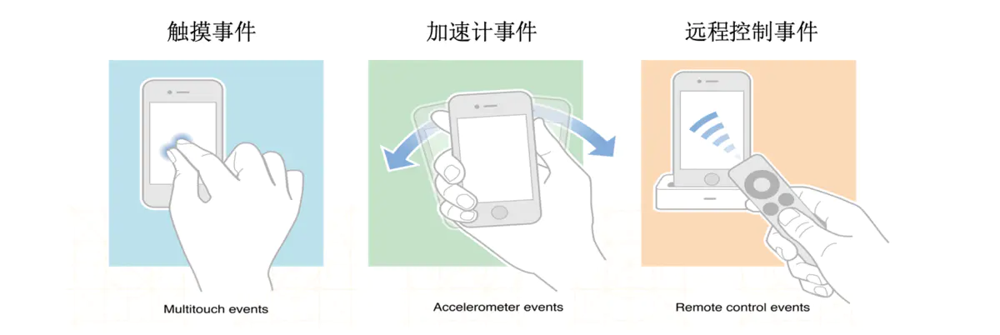
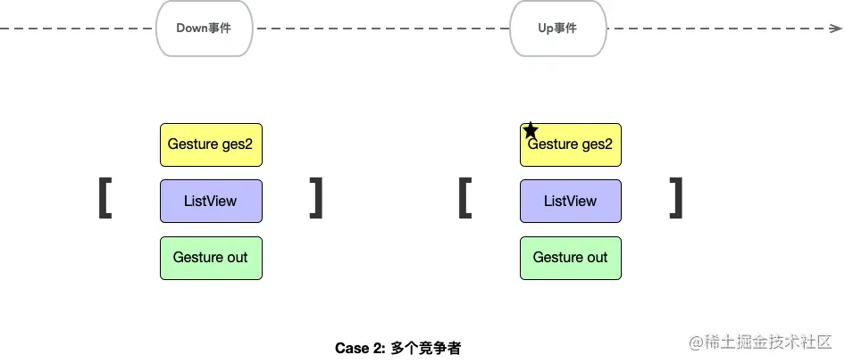

# 理解Flutter的事件分发


## 1. 事件
---
从某种意义上说，一个应用是UI、数据的展示,以及事件响应的集合.

在iOS系统有三类事件：触摸、加速器、远程控制；如果不涉及媒体播放、运动步数等功能，日常开发基本只关注触摸事件；

    UITouch:
    一根手指触摸屏幕，系统就会为其创建一个对应的UITouch对象，多个触摸点对应多个UITouch对象。存储触摸屏幕的时间、位置、力度、所在的window、所在的view等信息。系统判定对应的UITouch对象不会再更新，就会销毁它。

    UIEvent:
    事件触发后，系统创建UIEvent对象。存储着当前触摸事件的类型以及触发当前触摸事件的UITouch对象集合。

`Flutter的事件`：PointerEvent（及其子类PointerDownEvent、PointerMoveEvent、PointerCancelEvent、PointerUpEvent），事件对象包含存储触摸屏幕的时间、位置等信息。


## 2. 事件的产生
---
iOS: 用户点击屏幕后，系统创建一个触摸事件添加到UIApplication的事件队列，其处理事件的时候把该事件出列，按从顶到下交给屏幕上的window对象，window开始查找firstresponder。（通常是在keyWindow上，找到后也就确定了UITouch.window以及UITouch.view属性属性)

`Flutter`: flutter只是一个运行在原生应用中的UI框架，表现上是原生应用的一个view。因此它的事件来源于原生应用事件，当触发发生在flutter的view上时，它将event信息通过引擎派发到dart层。（dart线程的window.onPointerDataPacket方法）


## 3. 事件的响应者与响应者链
---
事件生成后需要有东西接收处理，我们称之为响应者；

iOS的ui组件不是全部都能响应事件，只有继承自UIResponder才可以；（UIApplication、UIViewController、UIView、UIButton...）

响应者链：屏幕上的响应者，UIKit框架在创建的时候就通过nextResponder属性反向串起来.


`Flutter`: RenderObject及其子类RenderPointerListener才能传递和响应事件 (它的widget是Listener)

    *flutter的widget分两类。
    1. 需要渲染到屏幕的，继承RenderObjectWidget，由RenderObject持有.
    2. 布局、点击、数据监听等不需要展示的包装组件，继承至StatelessWidget或StatefulWidget.

响应者列表：
不同于iOS根据view层级确定的响应链，flutter是在执行hitTest的时候把当前的响应者添加到响应者列表。


## 4. 事件传递 & 查找第一响应者
---
一个屏幕上通常会存在多个视图，要确定事件由谁处理，需要在视图之间传递事件进行判断；

事件传递的目的是为了确定响应者（firstResponsder）

在iOS，视图通过执行hitTest方法判断自身或子视图是否为`firstResponsder`, 过程中父视图会通过这个方法传递事件到子视图。
```objc
    - (UIView *)hitTest:(CGPoint)point withEvent:(UIEvent *)event {
    // 判断用户交互 || 隐藏 || 透明度
    if (self.userInteractionEnabled == NO || self.hidden == YES || self.alpha <= 0.01) {
        return nil;
    }
    
    // 触摸的点是否在当前view
    if ([self pointInside:point withEvent:event] == NO) {
        return nil;
    }
    
    // 倒序，从顶部遍历子视图
    for (int i = self.subviews.count - 1; i >= 0; i--) {
        UIView *childView = self.subviews[I];
        // 把触摸点的坐标转换到子视图的坐标系统下
        CGPoint convertedPoint = [self convertPoint:point toView:childView];
        // 事件传递：子视图hitTest找第一响应者
        UIView *fitView = [childView hitTest:convertedPoint withEvent:event];
        if (fitView) { // 如果最终找到了就返回
            return fitView;
        }
    }
    
    // 没有子视图 || 它的子视图都不能响应事件 || 触摸的点都不在它的子视图身上时
    // 当前view作为第一响应者
    return self;
}
```


`Flutter`: 也是类似的由RenderObject通过hitTest方法传递事件。根视图RenderView的hitTest方法开始，倒序(从顶部开始)添加到响应数组，数组的第一个就是firstRespondder；


## 5. 事件分发与响应
---
应用通过传递事件确定第一响应者后，将事件派发给第一响应者，然后沿着响应链传递处理事件。

iOS: touch对象收集到view后，UIApplication、window通过sendEvent方法把事件发送给它处理，
view响应事件，具体表现为touchesBegan/moved/canceled/ended的调用；
这四个方法的默认实现是调用nextResponser的几个touch事件.

`Flutter`: Listener的onPointerDown、onPointerMove、onPointerUp、onPointerCancel方法响应；

区别于iOS沿着响应链依次判断执行，flutter是遍历响应者数组的每一个HitTestEntry对象都执行handleEvent，因此数组第一个会先执行。


## 6 手势(iOS)
---
手势作为特殊的事件响应者来说明；
（手势的存在，大大丰富了用户与设备的交互blabla..）

iOS: UIGestureRecognizer不在响应者链里，也不是UIResponder的子类。它需要与view绑定，并观察事件派发的过程。与view的四个响应函数某种程度上是竞争关系。

```objc
@property (nonatomic) BOOL cancelsTouchesInView;
@property (nonatomic) BOOL delaysTouchesBegan;
- (BOOL)gestureRecognizer:(UIGestureRecognizer *)gestureRecognizer shouldReceiveTouch:(UITouch *)touch;
```

`cancelsTouchesInView`：默认YES，手势识别成功取消view的事件响应；设置NO,那么手势跟view都能响应；

`delaysTouchesBegan`：默认NO，系统直接调用view的touchBegan，手势识别后调用取消；如果YES，那么手势识别后会取消这个delay，结果是view连Began都没机会响应
方法gestureRecognizer:shouldReceiveTouch:：用于判定手势是否响应这个Touch事件

`delaysTouchesEnded` (默认为YES)：当手势识别器在识别手势时，对于UITouchPhaseEnded阶段的touch会延迟发送给hit-test view,在手势识别成功后,发送给hit-test view cancel消息，手势识别失败时，发送原来的end消息。

如果view实现了touch事件处理，同时有手势。当手势判定开始触发的时候，view的touch事件会被cancel（表现为执行cancel，且不执行end），如果是tap手势，那么连touchBegin都不会执行；

那是因为window在将触摸事件传递给第一响应者hitTested view之前，会优先把触摸事件传递给手势识别器。如果手势识别器成功识别了该触摸事件，那么手势识别器就拥有了该触摸事件的响应权。firstResponder本身则不会被调用响应方法；

UITouch.gestureRecognizers里存储的是响应者链上所有响应者的手势，他们都有比UIResponder更高的事件响应优先级。

### 6.1 多个Gesture Recognizer
view上可以绑定多个Gesture Recognizer, 触摸事件会无序优先传给gesture recognizer，没有手势识别成功则发送给hit-test的view。

1. 单击+双击手势，默认情况下点击一次两个手势都能识别到；如果想双击的时候，单击事件不触发，可以要求某个手势失败后才进行识别。（会有微小的延迟）

    [singleTapGesture requireGestureRecognizerToFail:doubleTapGesture];

2. 精准控制是否响应某个事件/序列

    UIGestureRecognizerDelegate	UIGestureRecognizer：canPreventGestureRecognizer..

3. 允许多个手势识别器共同识别, 默认no

    UIGestureRecognizerDelegate:shouldRecognizeSimultaneouslyWithGestureRecognizer
    
    举个例子：要记录window上的触摸事件，可以加一个手势，但是又不想影响其他手势处理，可以这里返回yes来实现。

4. UIScrollView控制触摸事件由子视图还是本身可以用它的以下方法

    – touchesShouldBegin:withEvent:inContentView:
    – touchesShouldCancelInContentView:
    canCancelContentTouches
    delaysContentTouches

### 6.2 Gesture与view/button
假设vc上有一个button，一个子view，三者都添加了tapGesture
● button点击: 触发tap，自身touch事件不执行（因为按钮响应是delay触发的，手势识别后可以cancel按钮的响应）
● 点view或vc上的view: view先执行touchBegan，然后手势识别成功执行，然后view执行touchCancel（delayTouchBegan的话，则view不会执行touch）
● 删除button的手势，点击按钮: 只执行按钮事件，nextRep的vc手势不触发
● button/view拖动: 当底下vc的拖动事件触发的时候，会执行按钮/view的cancel
● 子view跟按钮的手势互不影响，因为他们不是一个响应链


总结：

● 一般来说view跟gesture是独立传递事件的，view的事件默认从第一响应者开始沿着响应链处理。如果touch函数不调用super touchBegan，那只有第一响应者处理；
● 响应链上的手势，没有特殊设置的话，会按响应链先后顺序判定。只有一个手势响应。
● 当响应链上有手势识别成功，会执行view的touchCancel，包括子view。
● 特殊的，按钮的点击会消化掉事件，不会沿响应链传递，也就不会被父视图的手势取消；但拖动事件是会传递的，跟普通view表现一致。


## 7 手势(Flutter)
---

`Flutter`: flutter的手势本质上是Listener的包装，是一种特殊的响应者。

特殊之处在于，普通响应者handleEvent是执行具体地响应逻辑。
而手势的handleEvent是将自身添加到手势竞争管理类`GestureBinding.gestureArena`，等判定胜出了才会真正执行响应逻辑。
 - 当有一个手势判定通过执行acceptGesture，其他手势会执行 rejectGesture。
 - 由于要等待GestureBinding判定手势是否胜出，因此手势的响应总会晚于其他Listener。


    多手势竞争：
    在Down事件中，所有的竞争者被添加到_GestureArena进行竞争，最后回到GestureBinding关闭竞技场。这时如果区域中只有一个RawGestureDetector，则在Down事件阶段这个控件直接获得胜利，进行acceptGesture，但这时并不会触发onTap,等到Up事件之后,触发onTapUp,后执行onTap。

    如果只有一个手势类，那肯定是交给这个对象处理手势。但如果有多个手势识别类，在down事件阶段是无法判断这是一次什么样的行为，可能是点击（后续Up事件），可能是滑动（后续Move事件），所以Down事件阶段主要作用是收集手势竞争对象。
    
    如果区域内有多个RawGestureDetector，在Down 事件时竞技场 close 不会竞出胜利者。Up 事件的时候，竞技场 sweep 选取排在第一个位置的为胜利者进行acceptGesture。以上过程只是以点击为例。如果是滑动，肯定在Move阶段就产生了胜利者，不会等到Up事件。



    GestureBindg会从调用hitTest方法，从负责绘制的树根节点出发，递归收集所有区域范围内包含这个点击坐标的view得到一个hitTestResult集合，在树层级层级越深的view会被位置越靠前。在有了这个集合之后，遍历调用每一个对象的handleEvent，一般回调到RawGestureDetector中，会将自己添加到竞技场中。遍历完后如果竞技场只有一个参与者，则这个参与者直接获得胜利;如果有多个参与者，则暂时不会决出胜负。所以Case1中的out控件在down事件时竞争成功，并且回调onTapDown方法，但这是还不能认为onTap；而Case2中，参与竞争的有三个对象:out、listView、ges2，所以在down事件时无法选出胜者。
    
    Up事件会调用GestureArenaManager.sweep ，如果没有已经胜利的竞争者，则在这个阶段会强行选择hitresult中的第一位的竞争者为胜利，并且回调acceptGesture回调onTapUp和OnTap方法。


拦截事件的Widget:

IgnorePointer或AbsorbPointer，它俩分别有一个bool值属性叫ignoring、absorbing用来决定是否拦截事件


## 7 实践与应用
---
### 应用1: flutter内嵌native view 
在flutter早期版本，很多功能都不完善（比如webview连cookie设置都不支持），需要原生能力协助实现某些功能，具体表现为flutter页面的某个部分展示native视图。而官方提供的PlatformView早期也存在一些问题，碰到需要跟native进行特殊通讯的时候不大方便(比如与webview的jsbridge交互)

由于flutter在native层只是一个view，我们可以在它的上面放置其他的view，然后在最顶层加一个透明的window/view，来拦截hittest。自行实现视图的展示/隐藏，事件派发，从而实现flutter页面内嵌native view。

拦截hittest: 当需要底部的flutter层需要被点击的时候，顶层的view的hittest返回自己（作第一响应者）。否则不做处理，事件按原定流程处理。

自定义事件派发：重载keyWindow的sendEvent事件，根据事件类型调用flutterVc的touchBegin/Move/cancel/end事件。

注：flutterVc可以以子vc的形式添加到当前vc上管理，并且设置不可点击（保证flutter事件均由我们自行传递）


### 应用2: flutter无埋点事件监控
flutter分发事件的过程、响应者、widget、event都在各种的阶段处理各自的事情，没有一个时机可以同时获取到几个角色；而且flutter并不支持AOP，没办法像iOS那样方便地hook点击处理函数。

因此要实现无埋点事件监控，得通过重载相关系统类的方式实现；

需要重载的关键方法：
```dart
    // GestureBinding的派发事件方法.
    // 1. 把event跟hitTestResult 关联起来.
    void dispatchEvent(PointerEvent event, HitTestResult? hitTestResult) {}
```


```dart
    // GestureArenaManager的添加竞争者方法.
    // 2. 第一步hitTestResult的target，跟menber关联起来.
    GestureArenaEntry add(int pointer, GestureArenaMember member) {}
```

```dart
    // GestureArenaMember的接收/处理手势方法.
    // 3. 记录/上报该手势以及对应的，收集/查找到的，事件/widget信息.
    void acceptGesture(int pointer) {}
```

*为了收集具体地点击信息，还需要重载某些类，以及一些element树的查找过滤.

详细实现: [flutter_monitor](https://github.com/yangzhiquan/flutter_monitor
)