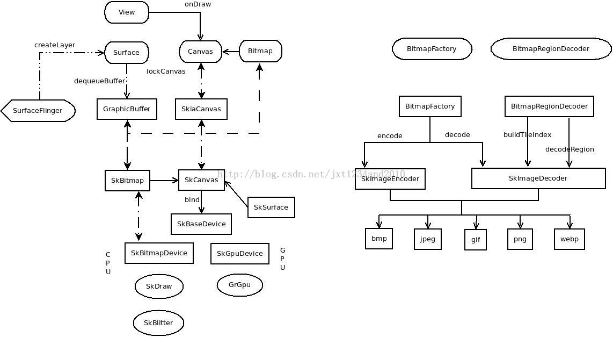
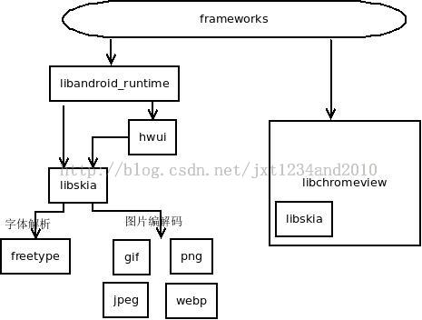
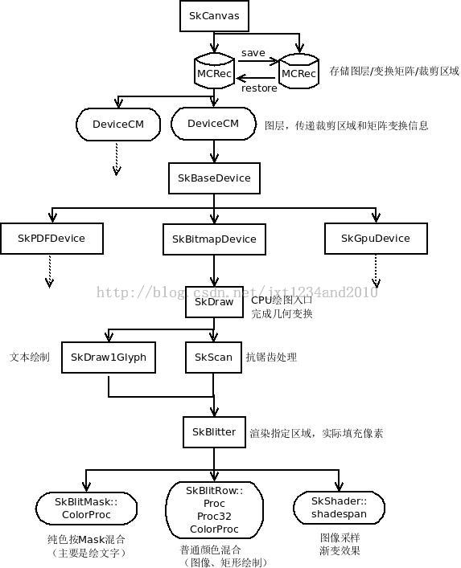
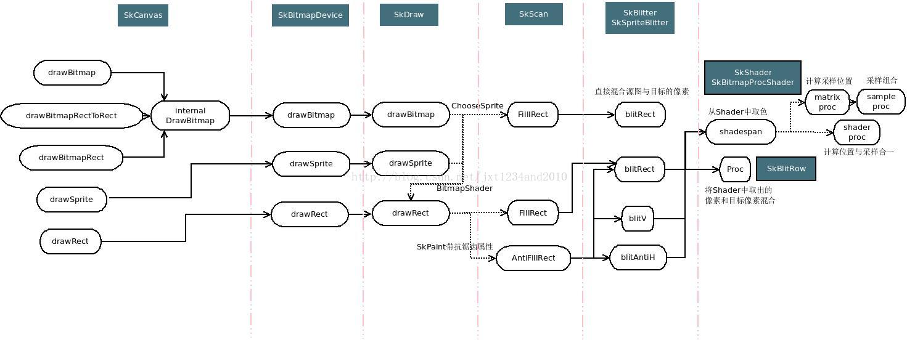
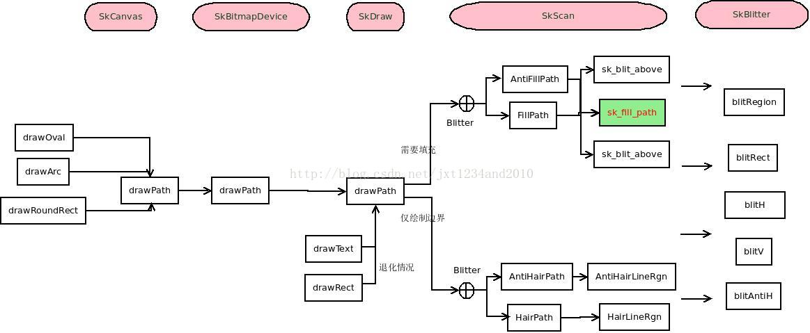
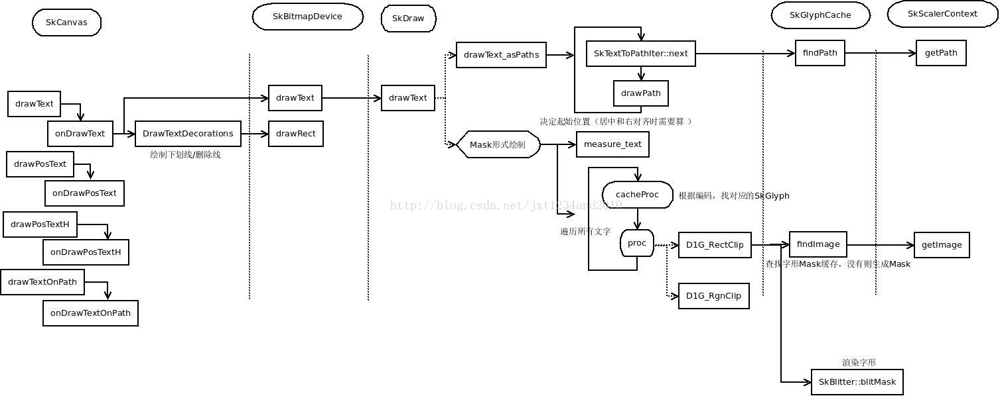

[TOC]

# [Skia](https://github.com/google/skia)

一张PNG图片是怎么展示到屏幕上的.SkPngCodec

把flutter engine跑起来

按照文档的目录来写


https://skia.org/docs/user/build/


什么是skia
如何构建skia
create skeleton
draw simple shapes
Text rendering
load/draw bitmaps
canvas transformations
objects blending & shaders


----------------------------
### 一. Skia在Android中的作用

1、规定2D绘制API
2、规定图像数据结构
3、承担编解码调度和软件渲染职责


##### 1. 界面绘制（lockCanvas——draw——unlockCanvas流程）
- UI控件，未开启硬件加速。由performTravelsals——drawSoftware调入。
Android显示系统是最复杂的Android最复杂的子系统，没有之一，这里只说明软件绘制时的一个基本过程：

    a、计算布局，看是否需要更新View。
    b、计算所有需要更新的View的区域，计算其最小外包矩形，即dirtyRect
    c、由Surface去Lock一个Canvas，Lock时指定dirtyRect，这里涉及gui的buffer轮换机制，会去获取一块未在显示的Buffer，由于换了buffer，在gui模块会去拷贝上一帧非dirtyRect的部分。
    d、执行根View的draw方法，递归调用所有子View的onDraw方法。由于Canvas对应的是软件绘制的canvas，所有绘制操作经过Canvas——SkiaCanvas——SkCanvas的流程，由skia引擎执行。（AndroidL上在jni（libandroid_runtime）处作了一层SkiaCanvas的封装，4.4及以前是Canvas——SkCanvas）
    e、完成绘制，让Surface去unlockCanvas，将绘制好的Buffer送显。


- SurfaceView，这个是由应用显式实现lockCanvas——draw——unlockCanvas流程。


##### 2. 图像处理
这种情况下，开发者自行基于目标Bitmap创建Canvas，调用Canvas的API绘制图像，一般是作图像的缩放、旋转处理，也可以加入渐变特效。（不是 lockCanvas 或 继承 onDraw 方法中传入的Canvas，就别想拿去上屏了）

##### 3. 图像编解码
Skia对各种类型的图片作了适配，提供统一的接口，开发者调用BitmapFactory，BitmapFactory进一步调用jni——skia。
（1）关于图像全解，这部分调用逻辑看上去简单，实际上对于输入输出流的处理还是比较复杂的，涉及Java的流——Skia规定的流——对应解码库的流两重转换。
（2）关于区域解码，这部分是google为平衡内存——性能——显示速度而设计的方案，一些Android机器上的图库打开照片时有一块一块渐渐清晰的过程，就是区域解码然后局部刷新的结果。
区域解码分成两步：
a、创建tileIndex，以便查找某个区域所对应的码流位置。
b、解码：输入指定区域，按照tileIndex查找对应码流，将对应区域的图片解出来，这个过程一般会调用多次。

##### 4. webview软件渲染
由于libchromeview将libskia以静态方法集成进去，便跟系统的skia库没什么关系了。对Android系统而言是统一的webview显示框架。

##### 5. 依赖与被依赖



Skia使用的库

- 图片编解码库

        libjpeg
        libpng
        libgif
        webp

- 字体解析

        freetype

调用skia的库

    libandroid_runtime：framework.jar的jni实现，链接framework和lib库的桥梁
    hwui：2D硬件加速库，使用skia的数据格式
    libchromeview：浏览器引擎，webview相关


----------------------------

### 二. Skia渲染架构

从渲染流程上分，Skia可分为如下三个层级：

  1. 指令层：SkPicture、SkDeferredCanvas->SkCanvas
  这一层决定需要执行哪些绘图操作，绘图操作的预变换矩阵，当前裁剪区域，绘图操作产生在哪些layer上，Layer的生成与合并。
  2. 解析层：SkBitmapDevice->SkDraw->SkScan、SkDraw1Glyph::Proc
  这一层决定绘制方式，完成坐标变换，解析出需要绘制的形体（点/线/规整矩形）并做好抗锯齿处理，进行相关资源解析并设置好Shader。
  3. 渲染层：SkBlitter->SkBlitRow::Proc、SkShader::shadeSpan等
  这一层进行采样（如果需要），产生实际的绘制效果，完成颜色格式适配，进行透明度混合和抖动处理（如果需要）



##### 主要类

1. SkCanvas
```
    创建 
    static SkCanvas* NewRasterDirect(const SkImageInfo&, void*, size_t);
    安卓5.0之后引入的离屏渲染：
    static SkCanvas* NewRaster(const SkImageInfo&);
    创建一个SkCanvas，绘制的内容需要通过readPixels去读取，仍然是CPU绘图的方式。
```
```
    状态
    矩阵状态：矩阵决定当前绘制的几何变换
    rotate、skew、scale、translate、concat

    裁剪状态：裁剪决定当前绘制的生效范围
    clipRect、clipRRect、clipPath、clipRegion

    保存与恢复：
    save、saveLayer、saveLayerAlpha、restore
```
```
    渲染：大部分渲染的API都可由这三个组合而成：
    drawRect（矩形/图像绘制）、drawPath（不规则图形图像绘制）和drawText（文本绘制）
```
```
    像素的读取与写入：readPixels、writePixels
    这两个API主要由device实现，考虑到不同绘图设备的异质性
```
```
    drawRect绘制：AutoDrawLooper的next实际上是做一个后处理，在存在 SkImageFilter 的情况下，先渲染到临时Layer上，再将这个Layer做Filter处理后画到当前device上。
    SkDrawIter，这个是绘制当前状态所依附的所有Layer。
```

2. MCRec状态栈
    fMCStack是存储的全部状态集，fMCRec则是当前的状态。在 save saveLayer saveLayerAlpha 时，会新建一个MCRec，在restore时，销毁栈顶的MCRec。(SkCanvas.cpp internalSave)

```c++
    每个状态包括如下信息：
    class SkCanvas::MCRec {
    public:
        int             fFlags;//保存的状态标识（是否保存矩阵/裁剪/图层）
        SkMatrix*       fMatrix;//矩阵指针，若这个状态有独立矩阵，则指向内存（fMatrixStorage），否则用上一个MCRec的fMatrix
        SkRasterClip*   fRasterClip;//裁剪区域，若这个状态有独立裁剪区域，则指向内存（fRasterClip），否则继承上一个的。
        SkDrawFilter*   fFilter;
        DeviceCM* fLayer;//这个状态所拥有的layer（需要在此MCRec销毁时回收）
        DeviceCM* fTopLayer;//这个状态下，所需要绘制的Layer链表。（这些Layer不一定属于此状态）
        ......
    };

    DeviceCM：图层链表，包装一个SkBaseDevice，附加一个位置偏移变化的矩阵（在saveLayer时指定的坐标）。
```

3. `SkDraw`是CPU绘图的实现入口，主要任务是做渲染准备（形状确定、几何变换、字体解析、构建图像Shader等）。

4. `SkBlitter`不是单独的一个类，指代了一系列根据图像格式、是否包含Shader等区分出来的一系列子类。
这一族类执行大块头的渲染任务，把像素绘制上去。

5. `SkScan`
在SkScan中，对每一个裁剪区域，将其与绘制的rect求交，然后渲染这个相交区域。此外，在需要时做抗锯齿。
做抗锯齿的基本方法就是对浮点的坐标，按其离整数的偏离度给一个alpha权重，将颜色乘以此权重（减淡颜色）画上去。
SkScan中在绘制矩形时，先用blitV绘制左右边界，再用blitAntiH绘制上下边界，中间大块的不需要考虑抗锯齿，因而用blitRect。

6. `SkBlitter`
（1）blitH
virtual void blitH(int x, int y, int width);
从x,y坐标开始，渲染一行width个像素
（2）blitV
virtual void blitV(int x, int y, int height, SkAlpha alpha);
从x,y开始，渲染一列height个像素，按alpha值对颜色做减淡处理
（3）blitAntiH
virtual void blitAntiH(int x, int y, const SkAlpha antialias[], const int16_t runs[]);
如流程图所标示的，这个函数的用来渲染上下边界，作抗锯齿处理。
（4）blitRect
virtual void blitRect(int x, int y, int width, int height);
绘制矩形区域，这个地方就不需要考虑任何的几何变换、抗锯齿等因素了。
（5）blitMask
virtual void blitMask(const SkMask& mask, const SkIRect& clip);
主要绘制文字时使用，以一个颜色乘上mash中的透明度，叠加。


##### 框架设计
1. 指令层与实现层分离
SkCanvas不直接执行渲染，由SkBaseDevice根据设备类型，选择渲染方法。这样虽然是同一套API，但可以用作GPU绘图、pdf绘制、存储显示列表等各种功能。

2. 图=形+色的设计思想
由SkDraw和SkScan类中控制绘制的形，由SkBlitter和SkShader控制绘制的色，将绘图操作分解为形状与色彩两部分，这一点和OpenGL的顶点变换——光栅——片断着色管线相似，非常有利于扩展，各种2D图元的绘制基本上就完全支持了。

3. 性能调优集中化
将耗时的函数抽象都抽象为proc，由一个工厂制造，便于集中对这一系列函数做优化。


### 三. Skia图片绘制的实现
```
bitmap：shader及采样原理，混合计算原理，多格式支持方法
path：不规则图形的绘制方式
text：文本解析方法，cache管理
```
1. API
```c++
drawBitmap:将bitmap画到x,y的位置（这本身是一个平移，需要和SkCanvas中的矩阵状态叠加）。
drawBitmapRect 和 drawBitmapRectToRect: 将源图src矩阵部分，画到目标dst区域去。最后一个flags是AndroidL上为了gpu绘制效果而加上去的，在CPU绘制中不需要关注。
drawSprite: 无视SkCanvas的矩阵状态，将bitmap平移到x,y的位置。
drawBitmapMatrix: 绘制的bitmap带有matrix的矩形变换，需要和SkCanvas的矩形变换叠加。

drawRect: 这个是最通用的方法，多用于需要加入额外效果的场景，比如需要绘制重复纹理。关于Tile的两个参数就是OpenGL纹理贴图中水平垂直方向上的边界处理模式。
由这种用法，大家不难类推到非矩形图像绘制的方法，比如画圆角矩形图标、把方图片裁剪成一个圆等。

#include "SkBitmapProcShader.h"
#include "SkCanvas.h"
#include "SkBitmap.h"
#include "SkImageDecoder.h"
#include "SkImageEncoder.h"
#include "SkRect.h"
int main()
{
    const int w = 1080;
    const int h = 1920;
    /*准备目标图片和源图片*/
    SkBitmap dst;
    dst.allocPixels(SkImageInfo::Make(w, h, kN32_SkColorType, kPremul_SkAlphaType));
    SkCanvas c(dst);
 
    SkBitmap src;
    SkImageDecoder::DecodeFile("test.jpg", &src);
 
    /*各种绘制图片方法使用示例*/
    {
        c.drawBitmap(src, 0, 0, NULL);
    }
 
    {
        c.drawSprite(src, 400, 400, NULL);
    }
    {
        SkRect dstR;
        r.set(29, 29, 100, 100);
        SkRect srcR;
        r.set(0,0,40,50);
        c.drawBitmapRectToRect(src, &srcR, dstR, NULL);
    }
    {
        SkMatrix m;
        m.setScale(1.4,4.3);
        c.drawBitmapMatrix(src, m, NULL);
    }
    {
        SkRect dstRect;
        dstRect.set(100,100,480,920);
        SkPaint paint;
        SkMatrix m;
        m.setScale(3.2, 4.1);
        SkShader* shader = CreateBitmapShader(src, SkShader::kRepeat_TileMode, SkShader::kRepeat_TileMode, m, NULL);
        paint.setShader(shader);
        SkSafeUnref(shader);
        c.drawRect(dstRect, paint);
    }
 
    /*输出图片*/
    SkImageEncoder::EncodeFile("output.jpg", dst, SkImageEncoder::kJPEG_Type, 100);
    return 1;
}
```


2. 绘制流程
   

        SkCanvas -> SkBitmapDevice -> SkDraw
        在SkDraw中，drawBitmap的渲染函数统一为：void SkDraw::drawBitmap

        创建BitmapShader
        在  SkAutoBitmapShaderInstall install(bitmap, paint); 这一句代码中，为paint创建了bitmapShader：

        然后就可以使用drawRect画图像了。图像绘制的实际渲染发生在某个blitter的blitRect函数中。
        drawRect通用流程: SkAutoBlitterChoose -> SkBlitter::Choose，根据Canvas绑定的Bitmap像素模式，paint属性去选择blitter。绘制图片时paint有Shader（SkBitmapProcShader），因此是选的是带Shader的Blitter，比如适应ARGB格式的 SkARGB32_Shader_Blitter

```
    裁剪区域的设置API:
    void SkCanvas::clipRect(const SkRect& rect, SkRegion::Op op, bool doAA)
    doAA即是否在r的边界非整数时考虑抗锯齿。
    满足条件，创建SkSpriteBlitter，由SkScan::FillIRect按每个裁剪区域调用SkSpriteBlitter的blitRect。
    这种情况下可以直接做颜色转换和透明度合成渲染过去，不需要做抗锯齿和图像插值，也就不需要走取样——混合流程，性能是最高的。
```

```
    SkDraw的drawBitmap的`Sprite简易模式`case:  

    if (bitmap.colorType() != kAlpha_8_SkColorType
        && SkTreatAsSprite(matrix, bitmap.dimensions(), sampling, *paint)) 
    kAlpha_8_SkColorType 的图像只有一个通道alpha，按 drawMask 方式处理，将Paint中的颜色按图像的alpha预乘，叠加到目标区域上
    just_translate表示matrix为一个平移矩阵，这时不涉及旋转缩放，bitmap的像素点和SkCanvas绑定的dstBitmap的像素点此时存在连续的一一对齐关系。

    if (clipHandlesSprite(*fRC, ix, iy, pmap))
    这个条件是指当前SkCanvas的裁剪区域不需要考虑抗锯齿或者完全包含了bitmap的渲染区域。SkCanvas的任何渲染都必须在裁剪区域之内，因此如果图像跨越了裁剪区域边界而且裁剪区域需要考虑抗锯齿，在边界上需要做特殊处理。

    满足条件后通过ChooseSprite去选一个SkSpriteBlitter。实际上很多场景都没覆盖到。
```

`blitRect`
这一步先通过 Shader的shadeSpan方法取对应位置的像素，再将此像素通过SkBlitRow的proc叠加上去。
如果不需要考虑混合模式，可以跳过proc。
参考代码：external/skia/src/core/SkBlitter_ARGB32.cpp 中的blitRect

`shadeSpan`
这里只考虑 SkBitmapProcShader 的shadeSpan，这主要是图像采样的方法。详细代码见 external/skia/src/core/SkBitmapProcShader.cpp
对每一个目标点，先通过 matrixProc 取出需要参考的源图像素，然后用sampleProc将这些像素合成为一个像素值。（和OpenGL里面的texture2D函数原理很类似）。
若存在 shaderProc（做线性插值时，上面的步骤是可以优化的，完全可以取出一群像素一起做插值计算），以shaderProc代替上面的两步流程，起性能优化作用。


##### 采样流程

图像绘制的实际渲染发生在某个blitter的blitRect函数中，先看一个具体的blitRect实现。
```
void SkARGB32_Shader_Blitter::blitRect(int x, int y, int width, int height) {

其中shadeSpan用来将shader中x，y坐标处的值取n个到dst的buffer中。
对于图像绘制时，它是 SkBitmapProcShader，这里是其实现：
old: void SkBitmapProcShader::BitmapProcShaderContext::shadeSpan(int x, int y, SkPMColor dstC[],
new: void shadeSpan(int x, int y, SkPMColor dstC[], int count) override {
        const SkBitmapProcState& state = *fState;
        if (state.getShaderProc32()) {
            state.getShaderProc32()(&state, x, y, dstC, count);
            return;
        }
```
    流程如下：
    1、存在 shaderProc，直接用
    2、计算一次能处理的像素数count
    3、mproc计算count个坐标，sproc根据坐标值去取色
    注意到之前三个函数指针：
    state.getShaderProc32
    mproc = state.getMatrixProc
    sproc = state.getShaderProc32
    这三个函数指针在一开始创建blitter时设定：
    SkBlitter::Choose -> SkShader::createContext -> SkBitmapProcShader::onCreateContext -> SkBitmapProcState::chooseProcs

    这是一个相当长的函数，它做的事情如下：
    1、（优化步骤）在大于SkPaint::kLow_FilterLevel的质量要求下，试图做预缩放。
    2、选择matrix函数：chooseMatrixProc。
    3、选择sample函数：
    （1）高质量：setBitmapFilterProcs
    （2）kLow_FilterLevel或kNone_FilterLevel：采取flags计算的方法,根据x,y变化矩阵情况和采样要求选择函数
    4、（优化步骤）在满足条件时，选取shader函数，此函数替代matrix和sample函数
    5、（优化步骤）platformProcs()，进一步选择优化版本的sample函数
    对于RGB565格式的目标，使用的是SkShader的 shadeSpan16 方法。shadeSpan16的代码逻辑类似，不再说明。
    bool SkBitmapProcState::chooseProcs() {


`MatrixProc`和`SampleProc`：MatrixProc的使命是生成坐标集。SampleProc则根据坐标集取像素，采样合成

    nofilter_dx、nofilter_dxdy系列：这两个系列是直接取了x,y坐标处的图像像素
    filter_dx、filter_dxdy系列：将四个相邻像素取出来之后，作Filter处理

    nofilter_dx，第一个32位数表示y，其余的32位数包含两个x坐标。
    nofilter_dxdy，用16位表示x，16位表示y。这种情况就是取的最近值，直接到x,y坐标处取值就可以了。
    filter_dxdy系列，每个32位数分别表示X和Y坐标（14:4:14），交错排列，中间的差值部分是相差的小数扩大16倍而得的近似整数。
    filter_dx系列，第一个数为Y坐标用14:4:14的方式存储，后面的数为X坐标，也用14:4:14的方式存储，前后为对应坐标，中间为放大16倍的距离，这个情况是一行之内y坐标相同（只做缩放或小数平移的情况），一样是作双线性插值。

    坐标计算有三种模式：CLAMP（越界时限制在边界）、REPEAT（越界时从开头取起）、MIRROR（越界时取样方向倒转去取）。
    sampleProc函数也是类似的方法组合出来的，

高级插值算法

    双线性插值虽然在一般情况下够用了，但在放大图片时，效果还是不够好。需要更好的效果，可以用高级插值算法，代价是性能的大幅消耗。
    高级插值算法目前在Android的Java代码处是走不进去的，不知道chromium是否用到。
    几个要点：
    1、在 setBitmapFilterProcs 时判断高级插值是否支持，若支持，设置 shaderProc 为 highQualityFilter32/highQualityFilter16（也就是独立计算坐标和采样像素）
    2、highQualityFilter先通过变换矩阵计算原始点。
    3、highQualityFilter根据 SkBitmapFilter  的采样窗口，将这个窗口中的所有点按其与原始点矩离，查询对应权重值，然后相加，得到最终像素点。
    4、SkBitmapFilter 采用查表法去给出权重值，预计算由子类完成。
    5、目前Skia库用的是双三次插值 mitchell 法。

    SK_CONF_DECLARE(const char *, c_bitmapFilter, "bitmap.filter", "mitchell", "Which scanline bitmap filter to use [mitchell, lanczos, hamming, gaussian, triangle, box]");
    详细代码见 external/skia/src/core/SkBitmapFilter.cpp，尽量这部分代码几乎无用武之地，但里面的公式很值得借鉴，随便改改就能做成 glsl shader 用。

    看完这段代码，可以作不负责任的猜想：Skia设计之初，只考虑了近邻插值和双线性插值两种情况，因此采用这种模板方法，可以最小化代码量。而且MatrixProc和SampleProc可以后续分别作SIMD优化（Intel的SSE和ARM的Neon），以提高性能。
    但是对于线性插值，两步法（取值——采样）在算法实现上本来就不是最优的，后面又不得不引入shader函数，应对一些场景做优化。高阶插值无法在这个设计下实现，因此又像补丁一样打上去。

小结
    第一：绘张图片看上去一件简单的事，在渲染执行时，真心不容易，如果追求效果，还会有各种各样的花样。
    第二：在性能有要求的场景下，用模板真是灾难：函数改写时，遇到模板，就不得不重新定义函数，并替换之，弄得代码看上去一下子混乱不少。
    第三：从图像绘制这个角度上看，skia渲染性能虽然确实很好了，但远没有达到极限，仍然是有一定的优化空间的，如果这部分出现了性能问题，还是能做一定的优化的。关于Skia性能的讨论将放到介绍Skia系列的最后一章。
    第四：OpenGL+glsl确实是轻松且高效多了，软件渲染在复杂场景上性能很有限。


### 四. skia路径绘制的实现

    路径绘制尽管使用频率相对于图像绘制、文本绘制低，但却是非常重要的一个基本特性。所有不规则图形（椭圆、圆角矩形、三角形、简单的文字），最后都避不开路径绘制。
    而且，若自己实现一个2D引擎，这块内容是很具有参考意义的，用OpenGL的话，图像采样等都很少关注了，对对坐标就好。但菱角、圆弧、曲线等如何绘制仍然是一个难题，这时就可以参考Skia中drawPath的实现。
    由于涉及较多的图形学知识，本章就不讲相关公式了，只讲讲基本的流程。

SkPath类

    在之前的图像绘制并没有介绍SkBitmap，因为SkBitmap相对而言比较容易理解，网上文章也多。但这次的SkPath不同，研究它怎么用是需要一点精力的，因此在这里先做介绍。
```
1、SkPath结构
去除成员函数之后，我们看到SkPath包括这几个成员，注释中补充了说明：

class SK_API SkPath {
    //SkPath中的主要内容，SkAutoTUnref是自解引用，之所以这么设计，是为了复制SkPath时，省去份量较多的点复制（只复制引用）。
    //由一系列线段组成
    SkAutoTUnref<SkPathRef> fPathRef;
 
 
    int                 fLastMoveToIndex;
    uint8_t             fFillType;//如下四种类型之一
    /*enum FillType {
        kWinding_FillType,//绘制所有线段包围成的区域
        kEvenOdd_FillType,//绘制被所有线段包围奇数次的区域）
        kInverseWinding_FillType,//kWinding_FillType取反，即绘制不在该区域的点
        kInverseEvenOdd_FillType//第二种type取反
        }*/
    mutable uint8_t     fConvexity;//凹凸性，临时计算
    mutable uint8_t     fDirection;//方向，顺时针/逆时针，临时计算
#ifdef SK_BUILD_FOR_ANDROID
    const SkPath*       fSourcePath;//Hwui中使用，暂不关注
#endif
};

```
关于 fFillType中 kWinding_FillType和 kEvenOdd_FillType的区别，可看SkPath::contains。这是判断点是否在不规则几何体内的经典代码()，很有参考意义。

```
class SkPathRef
{
private:
    mutable SkRect      fBounds;//边界，临时计算
    uint8_t             fSegmentMask;//表示这个Path含有哪些种类的形状
    mutable uint8_t     fBoundsIsDirty;//缓存fBounds使用，表示 fBounds是否需要重新计算
    mutable SkBool8     fIsFinite;    // only meaningful if bounds are valid
    mutable SkBool8     fIsOval;
 
 
    /*skia不使用stl库而采用的一套容器方案，具体不细说，可看下 SkPath::Iter 的实现*/
    SkPoint*            fPoints; // points to begining of the allocation
    uint8_t*            fVerbs; // points just past the end of the allocation (verbs grow backwards)
    int                 fVerbCnt;
    int                 fPointCnt;
    size_t              fFreeSpace; // redundant but saves computation
 
 
 
 
    SkTDArray<SkScalar> fConicWeights;
    mutable uint32_t    fGenerationID;
};
```
2、SkPath的主要类型：

kMove_Verb：表示需要移动起点
kLine_Verb：直线
kQuad_Verb：二次曲线
kConic_Verb：圆锥曲线
kCubic_Verb：三次曲线
kClose_Verb：表闭合到某点
kDone_Verb：表结束

3、drawPath使用实例
```

#include "SkPath.h"
#include "SkCanvas.h"
#include "SkBitmap.h"
 
int main()
{
    SkBitmap dst;
    dst.allocN32Pixels(1000, 1000);
    SkCanvas c(dst);
    SkPath path;
    /*一个三角形*/
    path.moveTo(300,0);
    path.lineTo(400,100);
    path.lineTo(200,100);
    path.close();
    /*椭圆*/
    SkRect oval;
    oval.set(0, 0, 500, 600);
    path.addOval(oval);
 
    c.drawPath(path);
    return 1;
}
```

4、drawPath流程


    这里主要跟进最重要的函数 sk_fill_path（src/core/SkScan_Path.cpp）
    不考虑 Inverse 的情况，主要就是两步：
    （1）生成一系列边：SkEdge
    （2）遍历渲染各边所围出来的区域


    凸集的渲染比较简单，因为可以保证，任意两条边+闭合线所围成区域一定需要渲染：
    （1）取初始的两条边，分别为：左和右。
    （2）渲染左右边+闭合边所围成的区域（一般为三角，当两边平行时取矩形）
    （3）迭代刷新左右两边（如果是曲线需要刷新多次）

    凹集或者判断不了凹凸性就比较复杂，需要一条线一条线去渲染，每次渲染还得判断奇偶性。代码如下，：
        walk_convex_edges、src/core/SkScan_Path.cpp：

    drawPath是绘制所有不规则形体的函数，带入Bitmap的Shader，可以制作不规则形体的图片。对于凸集，Skia的渲染主要也是切成三角片后渲染，和OpenGL类似。而对于凹集，则是扫描线了。渲染的实现和绘制图片一样，构建Blitter，调用Blitter的blit函数族渲染。

### 五. skia文字绘制
    文字绘制主要包括编码转换（主要是中文）、字形解析（点线或image）和实际渲染三个步骤。在这个过程中，字形解析和实际渲染均是耗时步骤。Skia对文字解析的结果做了一套缓存机制。在中文字较多，使用多种字体，绘制的样式（粗/斜体）有变化时，这个缓存会变得很大，因此Skia文字缓存做了内存上的限制


    SkCanvas
    绘制文字和下划线
    SkDraw

    两种绘制方式：
    （1）将文字解析为路径，然后绘制路径，缓存路径（drawText_asPaths）
    void SkDraw::drawText_asPaths
    （2）将文字解析为Mask（32*32的A8图片），然后绘制模板，缓存模板。

    cacheProc是翻译字符编码的函数，由SkPaint::getDrawCacheProc产生：

    SkGlyphCache：字形解析的结果缓存。

    SkScalerContext：负责字形的解析，有多种实现。Android中是用FreeType：SkScalerContext_FreeType。主要是generateImage和generatePath两个方法：

    generateImage：void SkScalerContext_FreeType::generateImage(const SkGlyph& glyph) {
                    SkScalerContext_FreeType_Base::generateGlyphImage

    字体缓存管理：SkTypeface是Skia中的字体类，对应可有多种字体库解析实现。由于Android上面使用的是FreeType。
    字体建立的代码：CreateFromStream & find_name_and_attributes

    当绘制字体只绘边界或者位图缓存机制不好处理时，将字体解析成点线，构成SkPath，也做缓存。


### 六. skia中图像编解码
    Skia中编码解码图片都只需要一行代码：
    SkJpegEncoder::Encode
    SkPngEncoder::Encode
    SkWebpEncoder::Encode

    SkBase64::Decode
    DecoderBench

    SkBitmap bitmap;
    SkImageDecoder::DecodeFile("test.xxx", &bitmap);//由文件名解码，自动推断图片类型
    //或者由流解码
    SkFILEStream stream("test.xxx");
    SkImageDecoder::DecodeStream(stream, &bitmap);//由输入流解码，自动推断图片类型
    //编码
    SkImageEncoder::EncodeFile("test.jpg", bitmap, SkImageEncoder::kJPEG_Type, 90/*编码图片质量，对jpeg格式和webp格式有用*/);


典型解码器的onDecode方法

    SkJpegDecoder
    src/codec/SkJpegCodec.cpp
    SkJpegCodec::MakeFromStream

    a、配置Jpeg解码选项（输出格式、采样率、idct类型、下采样率等等，在SkImageDecoder.h的注释中解释过一些）
    b、在不设置下采样且目标格式为RGBA时，直接解码到目标Bitmap上（Jpeg是按YUV三分量分别压缩的，设置为Jpeg库解码时作YUV-RGBA的颜色转换）。
    c、需要下采样时，由于jpeg库可作简化处理，因此重新计算一个下采样率，由SkScaledBitmapSampler将解码出来的图像下采样到目标bitmap上。

    Jpeg是有损压缩，传入的quality决定其量化参数表。
    a、Skia默认先将图片转为YUV444格式，再进行编码（WE_CONVERT_TO_YUV宏默认打开状态，否则就是先转为RGB888格式，再传入Jpeg编码时转YUV）。
    b、默认使用JDCT_IFAST方法做傅立叶变换，很明显会造成一定的图片质量损失（即使quality设成100也存在，是计算精度的问题）。


Png

    src/codec/SkPngCodec.cpp
    Png格式的图像可能包含透明度。Skia作了一个额外处理是检查其透明度是否全为255，是则置不透明标志，毕竟不透明的图像在后续渲染时消耗较少。

    a、将图像格式统一转为RGBA8888，再去作png编码，另外注明是否包含透明度信息。
    b、对于原先带透明的图像格式（RGBA8888，RGBA4444），做反alpha预乘，也即每个像素值除以其alpha值，自然，除法会做些转化由乘法替代的。


Gif

    值得注意的是Skia对于Gif动态图，只解最后一帧（SavedImage* image = &gif->SavedImages[gif->ImageCount-1];）
    至于Gif动画，由SkGIFMovie类处理，走不同的流程。应用需要调另外的类（详细见：frameworks/base/graphics/java/android/graphics/Movie.java）。

bmp

    这个是最简单的一种格式，用得较少，Skia里面的处理也比较随意。
    a、将流中内容全部读到内存（CopyStreamToStorage）
    b、解析流中的内容，将其转化为RGB格式（image_codec::BmpDecoderHelper::DecodeImage）
    c、使用SkScaledBitmapSampler，将RGB转成目标格式，同时作下采样。


### 七


### 八


### 九


### 十


