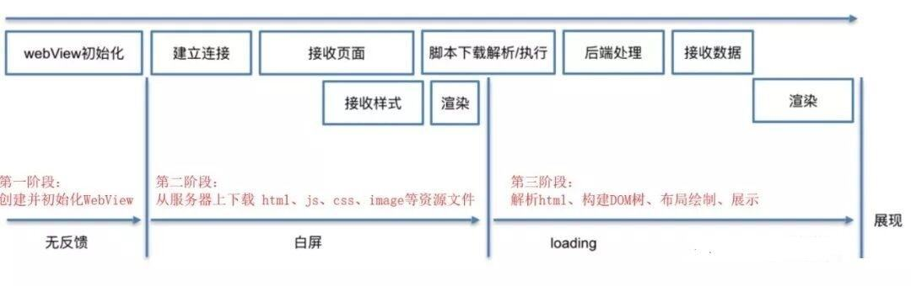

[TOC]
# Flutter与动态化

### 前言

编程语言要达到可运行的目的需要经过编译，一般地来说，编译模式分为两类：JIT 和 AOT。

JIT全称 Just In Time(即时编译），典型的例子就是 v8，它可以即时编译并运行 JavaScript。所以你只需要输入源代码字符串，v8就可以帮你编译并运行代码。通常来说，支持 JIT的语言一般能够支持自省函数（eval），在运行时动态地执行代码。

AOT全称 Ahead Of Time（事前编译），典型的例子就是 C/C++，LLVM或 GCC通过编译并生成 C/C++的二进制代码，然后这些二进制通过用户安装并取得执行权限后才可以通过进程加载执行。

### Flutter的编译模式
Script：同 Dart Script模式一致，虽然 Flutter支持，但暂未看到使用，毕竟影响启动速度。
Script Snapshot：同 Dart Script Snapshot一致，同样支持但未使用，Flutter有大量的视图渲染逻辑，纯 JIT模式影响执行速度。
Kernel Snapshot：Dart的 bytecode 模式，与 Application Snapshot不同，bytecode模式是不区分架构的。 Kernel Snapshot在 Flutter项目内也叫 Core Snapshot。bytecode模式可以归类为 AOT编译。
Core JIT：Dart的一种二进制模式，将指令代码和 heap数据打包成文件，然后在 vm和 isolate启动时载入，直接标记内存可执行，可以说这是一种 AOT模式。Core JIT也被叫做 AOTBlob
AOT Assembly: 即 Dart的 AOT模式。直接生成汇编源代码文件，由各平台自行汇编。

Flutter的核心还是跨平台而不是动态化，但这两者都是目前业界的诉求，因此才会有那么多的动态化方案产生。
Flutter框架的开发语言是Dart，实现动态化需要关注的是Dart语言的编译、运行过程.

- `AST`: 编译器把开发编写的业务代码跟FlutterSDK解析为一个抽象语法树（内存对象）
- `dill`、`bin`: AST对象序列化存到磁盘的文件类型; eg:app.dill，或者Debug阶段的产物(kernel_blob.bin) 
- `Dart Kernel`: AST文件的数据格式，能够被Dart VM解释执行；也是dart2js或其他转换的中间语言.
- `IL`: Intermediate Language, 要生成AOT产物，编译器会加载dill文件，编译成类似字节码的中间语言。

### DartVM

[Introduction to Dart VM](https://mrale.ph/dartvm/)

Dart VM 是一个执行 Dart 语言的组件集合: 
    1. 运行系统（对象模型、垃圾收集、快照）
    2. native代码核心库
    3. 开发体验优化组件（debug调试、性能分析、热重装）
    4. JIT、AOT编译管道
    5. 解释器
    6. 指令模拟器
    7. ...

Dart VM怎么执行Dart代码

    1. 从源码执行或者通过 JIT 执行内核二进制文件(Kernel binary)
    2. 从快照中恢复。（AOT快照或者AppJIT快照）
    3. 在VM上执行的 Dart 代码，都依赖 isolate（控制线程跟独占的堆内存等资源组合）
    4. 单线程模型，是指同一时刻，一个线程只能进入一个isolate。相同的系统线程可以首先进入一个 isolate，执行 Dart 代码，然后退出这个 isolate 在进入另外一个 isolate。
   
isolate 除了会关联一个突变线程，同时也会被关联到许多辅助线程，比如：

    一个后台的 JIT 编译线程；
    多个垃圾清理线程；
    多个并发的垃圾标记线程。

自从 Dart 2 版本之后，VM 已经没有了直接从源代码执行 Dart 的功能，取而代之的是，VM 只能执行那些由内核抽象语法树（Kernel ASTs）序列化成的内核二进制文件（Kernel binaries）（又被称作 dill files）。而将 Dart 源码翻译成内核抽象语法树的任务则交给了由 Dart 编写的通用前端`common front-end` (CFE）,这个工具被不同的 Dart 模块所使用（举个例子：虚拟机（VM），dart2js，Dart Dev Compiler）。

为了保留直接从独立源码直接执行 Dart 的便利性，专门还提供了一个辅助 isolate ，叫做 kernel service ，专门用来处理 Dart 源码编译成内核可执行文件的过程。之后 VM 就能直接执行生成的内核二进制文件了。

### 动态法方案

Flutter框架的三颗树

    WidgetTree:Widget 里面存储了一个视图的配置信息，可以高效的创建（build）和销毁
    Element 是分离 WidgetTree 和真正的渲染对象的中间层， WidgetTree 用来描述对应的Element 属性
    RenderObject 来执行 Diff， Hit Test 布局、绘制

##### 1.自定义模板代码

借鉴RN的思路，选一门可以在客户端执行的解析行语言，自定义一套模板跟目标语言的UI组件一一对应。比如采用js语言，再用json格式来定义模板语言。

基于这个思路的实现：
58的[fair](https://github.com/wuba/fair)

    优点：从RN的发展来看，这个方向是可取的.
    缺点：代码执行至少多一层解析。另外，都是用前端生态了，为何不直接用RN？？

##### 2.替换开发语言
[mxflutter](https://github.com/mxflutter/mxflutter)

代替Dart生成Widget树的职责。
用JS完整实现一遍Flutter SDK内置在工程中，JSCore或V8引擎运行编写的业务JS代码，生成一个WidgetTree，并序列化为json文件。Dart端加载该文件，转换为真正的Widget-Tree并进行渲染。

问题点：

    TS/JS->JSWidget->json->FlutterWidget链路较长，问题定位比较困难；生成WidgetTree效率就相对要低，再加上数据及事件通知需要反复经JS-Dart通道进行通讯等因素，都会导致UI渲染效率低下。

##### 3. 基于AST导出DSL

美团的MTFlutter: [Flap](https://tech.meituan.com/2020/06/23/meituan-flutter-flap.html)

原理是把Dart代码用Analyzer工具转为AST，简化保存为json文件。
终端有一个`解释器`，递归访问json中的节点，然后将json中的字符串映射到Dart代码中的函数，然后调用函数的万能方法Function.apply(),完成对应代码指令的执行。

    eg: 我们看"#FontWeight.normal"这个节点，从字符串到函数的映射就是{"#FontWeight.normal":()=>FontWeight.normal}。在访问"#FontWeight.normal"命名的这个节点时，只需调用:()=>FontWeight.normal这个函数的Apply()方法即可创建出对应的Dart对象。当然完整的实现还有更复杂的自定义类的解释要支持继承、混入等语法， 变量要支持作用域的管理等。

优点：

    前两个思路都是比较表层的动态化，对Dart开发有很大的影响 (动态化跟目标代码语言不同)。而从AST层往下的动态化则可以让上层Dart开发者在编码阶段无感知。

问题点：

    由于AST未经过编译，每个代码文件生成的AST中都只包含当前文件的信息，缺乏代码精确的数据类型、代码上下文及依赖关系等关键信息。因此在解释过程中经常会遇到类型推断上的困难，在处理比较复杂的继承关系或隐式依赖时，因缺乏对应信息而找不到对应的符号以完成执行。MTFlutter解决这一问题的方法是限制Dart语法的使用。

##### 4. 基于Dill文件

由于Analyzer解析Dart代码得到AST中信息不够完备，导致很多正常的Flutter代码写法无法顺利解释执行。尤其是如果项目要依赖一些Flutter社区提供的有比较复杂写法的一些第三方库，更是举步维艰。为了解决这一问题，将动态化产物调整为使用Kernel Binary。

UC的[Aion](https://mp.weixin.qq.com/s/mPkx9b07xCkokxxbGc7grA) 、手Q的 DNFlutter.

需要动态化的代码编译为Dill文件后，通过在AOT模式下增加对KBC 解释器的支持，实现KBC与AOT在混合模式下运行。，直接用DartVM将这部分解释执行；

问题点： 

    Flutter新版本已经裁剪掉了KBC解释器代码，为适应Flutter后续版本的升级和变化，需要自行对KBC解释器代码进行维护，维护的成本随着Flutter版本的不断升级也将不断升高。而且内置一个解释器也增加不少包体积。

##### 5. 基于IL指令集

基于Dart的中间语言(IL, Intermediate Language)，参考并定制Dart VM本身的C层实现，在Dart层设计了一套指令集和栈帧式虚拟机，在运行时，将IL转化为指令集逐条执行。

实现包含两个关键要素：

① 生成IL

Flutter&Dart工具链：编译Flutter&Dart源码，得到中间语言IL
IL二进制格式的读写：将IL输出为二进制格式，提升读取效率
② 执行IL

指令集：作为IL的内存数据表示
栈帧式虚拟机：执行指令，对栈元素进行精准控制
代理生成器：自动生成Flutter&Dart核心库的代理实现

##### 6. 基于so文件

Android端的产物是so文件，是可以直接替换的。方案仅限于安卓系统。

----
##### 换一个角度看动态化方案（摘自MTFlutter文章）

    a. 产物替换 对应上诉的6

    选型中首先考虑到的是下发产物替换，官方在也曾经推出了 Code Push 方案，甚至可以支持 Diff 差量下载，但是在 2019 年 4 月被叫停。

    简而言之，就是官方对动态化后的性能没有自信，并且对安全性有所顾虑。之前，官方提供方案的局限性也十分明显。比如对 Native-Flutter 混合 App 支持不友好，并且无法进行灰度等业务定制操作，所以不能满足通用性和高性能的核心目标。

    b. AOT 搭载 JIT

    Flutter 在 Release 模式下构建的是 AOT 编译产物，iOS 是 AOT Assembly，Android 默认 AOTBlob。 同时 Flutter 也支持 JIT Release 模式，可以动态加载 Kernel snapshot 或 App-JIT snapshot。如果在 AOT 上支持 JIT，就可以实现动态化能力。但问题在于，AOT 依赖的 Dart VM 和 JIT 并不一样，AOT 需要一个编译后的 “Dart VM”（更准确地说是 Precompiled Runtime），JIT 依赖的是 Dart VM（一个虚拟机，提供语言执行环境）；并且 JIT Release 并不支持 iOS 设备，构建的应用也不能在 AppStore 上发布。

    实现此方案需要抽离一份 DartVM 独立编译，再以动态库的形式引入项目。通过初步测试，发现会增大包体积 20MB+，这超过了 MTFlutter 之前做 Flutter 包体积优化的总和。进一步让 Flutter 包体积成为推广与接入业务方的巨大阻碍，不满足我们对适用性的要求。

    c. 动态生产 DSL

    Native 侧本身具备 JS 动态执行环境，利用这个执行环境动态生成包含页面和逻辑事件绑定 DSL，进而解析为 Flutter 页面或组件，也可以实现动态化诉求。技术思路接近 RN，但与其不同的是利用 Flutter 渲染引擎和框架。这种先将代码执行起来再获取 DSL 的手段，我们简称为动态生产 DSL。

    此方案可以很好地支持逻辑动态化，但弊端也比较明显。首先要对齐 Flutter 框架，JS 侧的开发量很大且开发体验受损。另外，对 JS 的依赖偏重，构建的 JS 框架本身解释执行有一定开销，对于页面逻辑与事件在运行中需要频繁地进行 Flutter 与 JS 的跨平台通信，同样也会产生一定开销。这不能满足 MTFlutter 团队对高性能的诉求。更严重的是，此方案对开发同学的开发习惯并不友好，将 Dart 改为 JS，现有的 Flutter 开发工具无法直接使用，这与低成本诉求背道而驰。

    d. 静态生产 DSL

    前面说 “将代码执行起来再获取 DSL 的手段，我们简称为动态生产 DSL”，那么代码不执行直接转换 DSL，就称为静态生产 DSL 方案。

    静态生产的特点是抹平了平台差异，因为 input 是 Dart source 与平台无关，直接将 Dart source 内的完整信息通过一层转换器转换到 DSL，然后通过 Native 和 Dart 的静态映射和基础的逻辑支持环境，使得其可以在纯 Dart 的环境下渲染与交互。

    在具体实现上，可以利用 Dart-lang 官方提供的 Analyzer 分析库（该工具在 Dartfmt、Dart Doc、Dart Analyzer Server 中都有使用）构建 DSL。该库提供了一组 API 能对 Dart source 进行分析，按照文件粒度生成 AST 对象。AST 对象用整齐的数据结构包含了 Dart 文件的所有信息，利用这些信息可以便捷地生成所需的 DSL。所有的这个分析 + 转换的过程全部在线下进行。接下来， DSL-JSON 以 Zip 的形式下发，Flutter 的 AOT 侧以此为数据源，完成整个 Flutter 项目的渲染与交互。

    这种方案，一来可以保持 Flutter/Dart 的开发体验，也没有平台差异，逻辑动态化依赖静态映射和基础逻辑支持，而非 JScore，有效地避免了性能上的开销。

----

##### 推荐方案 阿里的Kraken(微信的liteapp) 与 手Q的 DNFlutter

    Kraken实现了一套兼容W3C规范的DOM API，上层业务逻辑最终通过统一的DOM API，经过Bridge层完成js-dart的通信，上层的指令传递到Flutter端，实现对Flutter端的调用。在Flutter端直接使用Render Object进行绘制后直接挂载到RenderView上进行渲染。
    在跨端通信上，采用基于dart:ffi的方案解决效率问题。

整个架构设计依然是类 RN 方案，只是 Native 渲染层从系统平台侧切换成了 Flutter Engine 自绘，以解决跨端渲染不一致的问题，Flutter 自身的问题依然存在（如内存占用过大、包增量、图片内存问题等）。同时通过 Flutter Engine 提供的 FFI 通信接口进行 JSCore 与 Flutter 之间的通信，缓解了类 RN 方案中 JSBridge 通信效率低导致的排队性能瓶颈。

---
    手Q的 DNFlutter 基于Kernel Binary，自己实现解释器（Flutter代码的中间编译产物dill文件的数据格式，dill文件中其实也包含一个AST，叫做Kernel AST，并且系统提供了一个名为Kernel的库，支持对Kernel AST中节点的访问，并且支持懒加载）。
    Kernel AST最大的优势是其经过了编译过程中的类型推断（TFA），因此节点中包含精确的数据类型信息。dill文件中也包含类的继承、混入经编译处理后的完整信息，在信息上基本是完备的。这就为支持完整的Flutter代码的写法提供了基础和前提。本方案实现的解释器在解释能力上有了很大的加强，比较复杂的继承和混入写法的解释也可以支持。通过扫描Kernel AST，可以对动态化代码依赖的符号进行精确的定位，再借助自动化脚本，就能对项目以来的镜像代码进行生成，并保证符号的完备性。

    在性能上，由于Kernel Binary是一种二进制格式，在格式上更为紧凑，加载和访问的速度相比json格式也有很大的提高。由于支持懒加载，AST加载及访问的耗时不再随代码量的增加而线性上升，因此可以支持更复杂的业务进行动态化。

DNFlutter整体流程

    将 Dart 业务源码通过 DNFlutter 的 flutter_ast_gen.sh 脚本生成 dill，app.dill 包括系统 library, 再通过裁剪生成 ast.zip，目的是为了仅保留业务代码部分，以减少下发的包大小
    接着通过 run_buildin_builder.sh 生成业务代码的系统依赖符号，实现解释器对原生类的转调，检查是否会有未内置的 buildin。注意，目前 buildin 只能内置在宿主工程，随宿主工程一起编译，业务代码变只能依赖已有的 buildin，因为 AOT 编译后，不被引用的符号会被裁减了，所以得加个 build_in 保证符号被引用，这样 AST 运行时才有这些符号。
    宿主工程在 AOT 侧通过 DNFlutter 提供的 AST Runtiime 解释执行 AST。在 buildin 不变情况下，通过在线下发 AST 资源实现动态化。

-----
结尾：动态化都避免不了一个问题：错误定位都比较困难；语法支持不完善；Flutter版本更新后难以跟上。

# 传统动态化
 
 分为基于Webview的动态化比如H5或者小程序，跟基于Native渲染的方案。

##### 1. 基于Webview
 

对于一、二阶段的耗时可以做一些优化；

    H5: 常见的比如12306，通过Webview预热、并发网络请求、离线包等方案进行性能优化；
    小程序：代码及资源预下载、UI渲染与业务逻辑各自一个独立线程等性能优化措施；

但第三阶段的渲染耗时跟事件响应的优化则难以进行。

Webview的渲染流程Html->DomTree ->RenderTree->RenderLayer+栅格化->合成->GPU渲染。
相比比Native的View->Layout->RenderNode->合成->GPU渲染要多出好几步，并且渲染管线不支持批量处理，因此在性能上优化空间有限，遇到UI频繁更新的场景，性能下降尤为明显。（批量渲染是通过减少CPU向GPU发送渲染命令的次数，以及减少GPU切换渲染状态的次数）

##### 2. 基于Native

 为了上诉第三阶段解决渲染问题，`ReactNative`这类框架改用JSCore或V8引擎解释执行代码，并构建Virtual DOM Tree来合并界面变动，最终映射为Native组件进行渲染。

 这样解决了渲染的效率问题，但是由于依赖平台UI，灵活性受到限制；而且也存在加载、跨端通讯、编解码、等耗时问题。

