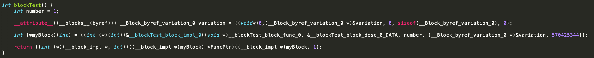
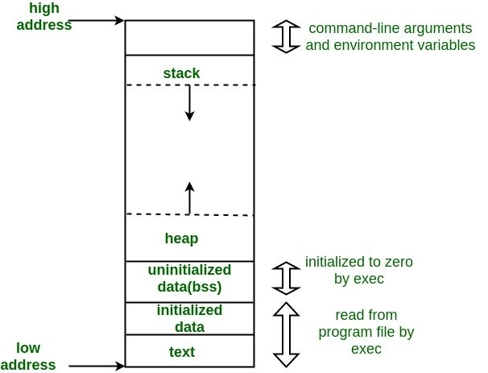
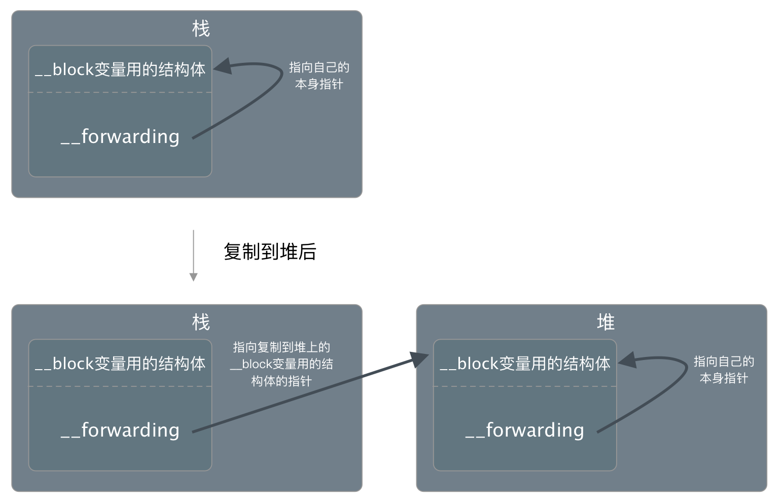
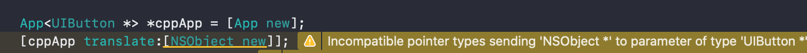
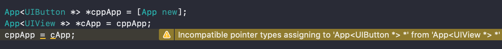
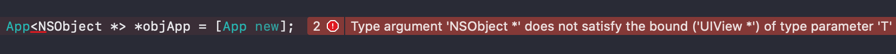

## 回顾Objective-C的闭包与泛型

    OC作为编程语言界的80后的，为了能跟新生代的语言有点共同点，也曾让编译器给自己加一些新特性，比如闭包、为空性、泛型等。

#### 1.1 定义
block是Objective-C的闭包实现，它的声明跟定义为：

```objc
    返回类型 (^名称)(参数类型) = ^返回类型 (参数) { 代码 };
    // eg:
    int (^numberValue)(NSNumber *) = ^int (NSNumber *num) {
        return num.intValue;
    };
```
执行一个block本质上还是函数调用。编译器编译时会生成一个对应的函数，再把这个函数地址，以及block引用的外部变量用一个结构体存起来，执行的时候以参数的形式传入函数。


#### 1.2 内部实现与变量捕获
通过clang可以将其转换为C++代码，比如这样一个函数，执行clang -rewrite-objc main.m转换为C++为下图.

```objc
int blockTest() {
    int number = 1;
    __block int variation = 0;
    int (^myBlock)(int) = ^(int param) {
        ++variation;
        return number + variation + param;
    };
    return myBlock(1);
}
```

可以看到创建block实际上是实例化了一个结构体 __blockTest_block_impl_0(xxx)，结构体的命名是所在的函数+block_impl+函数里面第几个block.
传入的参数是一个函数指针，一个desc结构体指针。还有两个参数，外部变量number的值，以及外部变量variation的指针。（flags这里忽略，它的作用可以看[Block-ABI文档](https://clang.llvm.org/docs/Block-ABI-Apple.html)）


```cpp
struct __blockTest_block_impl_0 {
  struct __block_impl impl;
  struct __blockTest_block_desc_0* Desc;
  int number;
  __Block_byref_variation_0 *variation; // by ref
  __blockTest_block_impl_0(void *fp, struct __blockTest_block_desc_0 *desc, int _number, __Block_byref_variation_0 *_variation, int flags=0) : number(_number), variation(_variation->__forwarding) {
    impl.isa = &_NSConcreteStackBlock;
    impl.Flags = flags;
    impl.FuncPtr = fp;
    Desc = desc;
  }
};
```
函数指针参数是传给impl的FuncPtr的，其余的值结构体自己持有着。

从名字跟作用看impl这个__block_impl结构体就是block本体了。可以理解为一个“基类”，代码定义的block编译器都会生成一个个对应的“派生类”。
```cpp
struct __block_impl {
  void *isa;
  int Flags;
  int Reserved;
  void *FuncPtr;
};

```

对于number跟variation两个参数，由于block内部不需要对number作修改，所以只是值引用，而对variation变量有作修改，需要加__block声明，编译器会用__Block_byref_xx的结构体包装这个变量，再以把它的地址作为参数传入block。


#### 1.3 block执行函数
block的构建函数第一个参数是一个函数指针，它是编译器拿block内的代码生成的函数，这个函数的参数是block结构体指针，以及其他block声明的参数。

```cpp
static int __blockTest_block_func_0(struct __blockTest_block_impl_0 *__cself, int param) {
  __Block_byref_variation_0 *variation = __cself->variation; // bound by ref
  int number = __cself->number; // bound by copy
  ++(variation->__forwarding->variation);
  return number + (variation->__forwarding->variation) + param;
}
```

#### 1.4 block内存管理
前面的构造函数里面，isa的值编译器是指定了&_NSConcreteStackBlock。这意味着这个block会在进程的虚拟内存空间的栈区创建，函数执行结束堆栈销毁的时候它也会被销毁。

如果这个block是在函数外创建的一个全局block，那编译器会指定isa为&_NSConcreteGlobalBlock。

如果代码对block执行了copy操作，那它会从栈区拷贝到堆区，isa指向&_NSConcreteMallocBlock，由程序自行管理引用计数。



对于声明了__block的变量，前面说编译器会用一个结构体来包装这个变量，比如

```cpp
struct __Block_byref_variation_0 {
  void *__isa;
  __Block_byref_variation_0 *__forwarding;
  int __flags;
  int __size;
  int variation;
};  
```

当block从栈复制到堆时，这些变量也全部被从栈复制到堆上。在栈上的时候Block_byref的__forwarding指向自己，在堆上时则指向堆上的结构体实例。


block构建函数的第二个参数block_desc里面有block_copy跟block_dispose，会负责释放block引用的外部变量。


#### 1.5 链式调用
block的引入给oc带来不少便利，比如可以让一个实例函数通过返回一个block，然后block返回实例本身来达到链式调用的效果。

```objc
- (Object *(^)(int num))add {
    return ^Object *(int num) {
        self->_result += num;
        return self;
    };
}

Object *maker = [Object new];
maker.add(2).add(3);
```

---

### 2.1 什么是泛型？
泛型是把数据的类型参数化，可以编码的时候不指定具体的类型，延后到使用的时候才进行指定。

使用泛型除了可以让代码更简洁减少重复工作外，限定了类型也会让程序更加健壮，提升代码可读性和稳定性。

```objc
@interface App<T> : NSObject
- (void)translate:(T)obj;
@end
```

 比如对于这个App类，创建的时候指定了Button，那么translate的类型T就是Button，传个Object对象编译器会警告。（但也仅仅是警告⚠️而已..）



#### 2.2 协变与逆变
OC的泛型可以指定允许协变还是逆变。

__covariant(协变):用于泛型数据强转类型,子类可以转成父类；
__contravariant(逆变):用于泛型数据强转类型,父类可以转成子类；

```objc
@interface App<__covariant T> : NSObject
@end
```

 比如我们加上__covariant声明之后，转父类是没有警告的，但是第二行父类想转子类就来警告了。设置__contravariant就反过来了。
 

#### 2.3 其他
1. 指定多个泛型，比如X是输入类型，Y是转换类型，Z是结果类型.
```objc
@class MyClass<X, Y, Z>;
```

2. 限定泛型的范围

限定为UIView或者派生类型
```objc
@interface App<__covariant T: UIView *> : NSObject
@end
```

限定为实现某个协议的类型
```objc
@interface App<__covariant T: id<UITableViewDelegate>> : NSObject
@end 
```

有别与前面的警告，不按泛型声明的类型来传值是会报错的。


