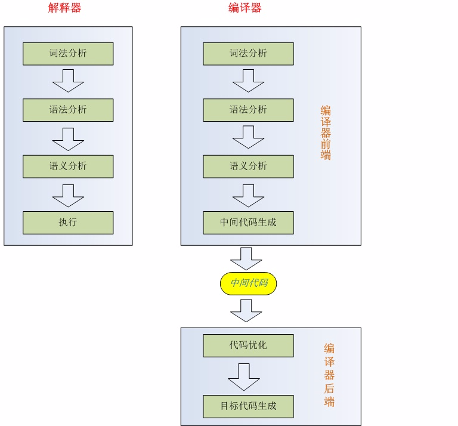
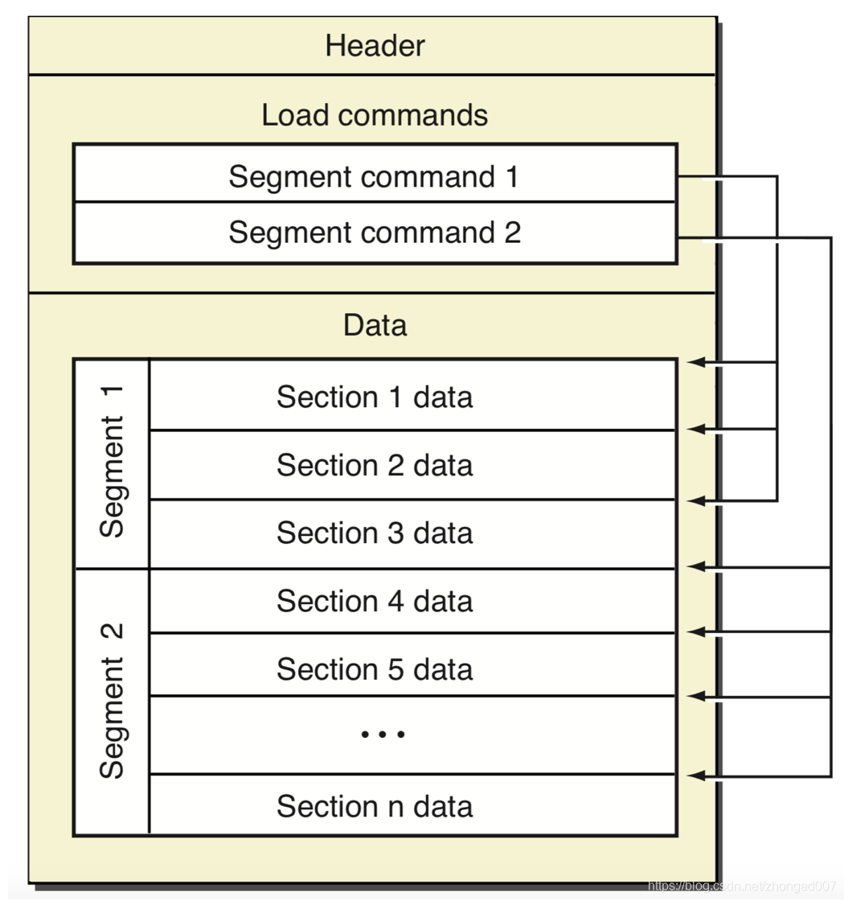
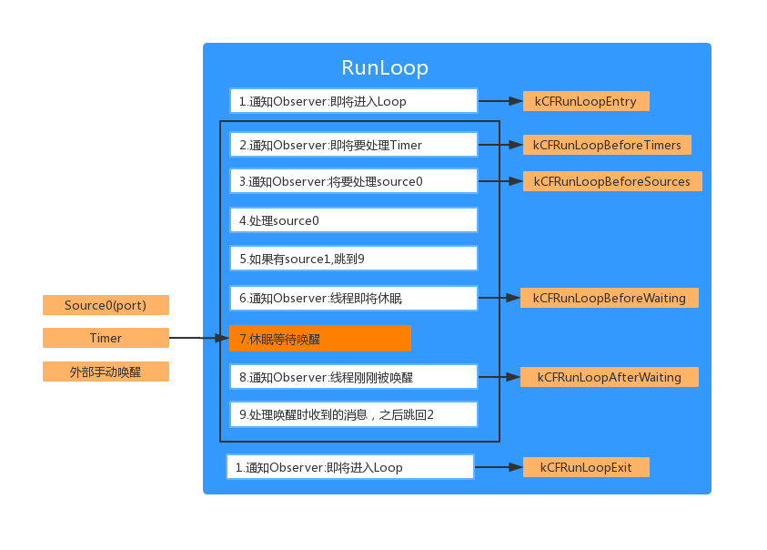
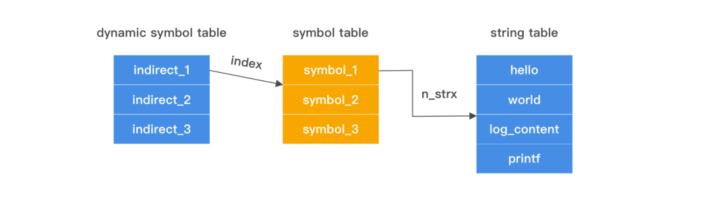
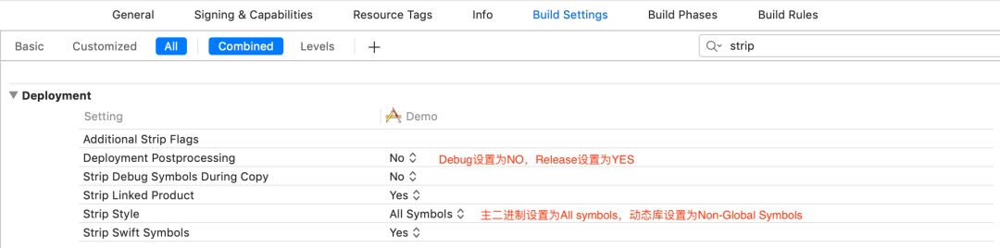

[TOC]

### 一：iOS基础：编译、启动与运行

##### AOT与JIT, 编译器与解释器
高级语言代码都需要转换成二进制码才能被CPU执行, 转换方式分为两种:
一是运行前编译好，AOT(Ahead of Time)，转换的程序称为编译器.
二是运行中逐条翻译成二进制码.JIT(Just In Time). 转换程序称为解释器.

解释器：在运行时依次获取每一段代码将其翻译成目标代码（字节码），一句一句地执行.
编译器：把一种编程语言转换为另一种编程语言的程序（原始语言到目标语言）

---
##### 编译器的前端和后端

`前端`：前端负责语法分析、词法分析，生成中间代码
`后端`：后端以中间代码作为输入，进行架构无关的代码优化，接着针对不同架构生成不同的机器码



    Xcode使用的编译器前端是clang,后端LLVM
    LLVM 是编译器工具链技术的一个集合。其中的lld，就是内置链接器。编译器会对每个文件进行编译，生成 Mach-O（可执行文件）；链接器会将项目中的多个 Mach-O 文件合并成一个。


##### 编译过程
前端:

    预处理：Clang预处理代码（替换宏、删注释、条件编译

    词法分析：词法分析器读入源文件的字符流，将他们组织称有意义的词素(lexeme)序列，对于每个词素，此法分析器产生词法单元（token）作为输出。并且会用Loc来记录位置。

    语法分析：把词法分析生成的标记流，解析成一个抽象语法树（abstract syntax tree -- AST）,同样地，在这里面每一节点也都标记了其在源码中的位置。
    AST 是抽象语法树，结构上比代码更精简，遍历起来更快，所以使用 AST 能够更快速地进行静态检查。

    静态分析：把源码转化为抽象语法树之后，编译器就可以对这个树进行静态分析处理。静态分析会对代码进行错误检查，如出现方法被调用但是未定义、定义但是未使用的变量等，以此提高代码质量。最后 AST 会生成 IR，IR 是一种更接近机器码的语言，区别在于和平台无关，通过 IR 可以生成多份适合不同平台的机器码。
    静态分析的阶段会进行类型检查，比如给属性设置一个与其自身类型不相符的对象，编译器会给出一个可能使用不正确的警告。在此阶段也会检查时候有未使用过的变量等。
后端:

    中间代码生成和优化：此阶段LLVM 会对代码进行编译优化，例如针对全局变量优化、循环优化、尾递归优化等，最后输出汇编代码 xx.ll文件。

    生成汇编代码： 汇编器LLVM会将汇编码转为机器码。生成二进制.o文件。

    链接：连接器把编译产生的.o文件和（dylib,a,tbd）文件，生成可执行文件mach-o文件。


##### [Mach Object](https://developer.apple.com/library/archive/documentation/DeveloperTools/Conceptual/MachOTopics/0-Introduction/introduction.html#//apple_ref/doc/uid/TP40001827-SW1)文件
    通过clang -c demo.c 生成.o文件
    file demo.o命令查看.o文件


主要部分
* Header：文件的目标cpu架构等基本信息。
    ```
    struct mach_header_64 {
        uint32_t        magic;      // 64位还是32位
        cpu_type_t      cputype;  
        cpu_subtype_t   cpusubtype; // CPU 子类型，比如 armv8 CPU_SUBTYPE_ARM_64
        uint32_t        filetype;   // 文件类型 MH_EXECUTE
        uint32_t        ncmds;      // load commands 的数量
        uint32_t        sizeofcmds; // load commands 大小
        uint32_t        flags;      // 标签
        uint32_t        reserved;   // 保留字段
    };
    ```
* Load Commands：文件的逻辑结构和在虚拟内存中的布局，告诉加载器如何加载每个Segment的信息（Mach-O文件可以有多个Segment，每个Segment可能有一个或多个 Section）
* Data（数据区），Segment的具体数据，包含了代码和数据等。


具体部分

    文件头 mach64 Header
    加载命令 Load Commands
    文本段 __TEXT
    数据段 __DATA
    动态库加载信息 Dynamic Loader Info
    入口函数 Function Starts
    符号表 Symbol Table
    动态库符号表 Dynamic Symbol Table
    字符串表 String Table


##### 链接器
绑定代码变量、函数符号跟它们内存地址; 
比如 if、for、while 生成的机器指令序列，要操作的数据会存储在某个地方，变量符号就需要绑定到数据的存储地址。代码还会引用其他的代码，引用的函数符号也需要绑定到该函数的地址上。（否则要让机器知道你在操作什么内存地址，你就需要在写代码时给每个指令设好内存地址。
`符号`: 变量/函数名..
`代码` 与 `数据`: 代码编译之后，函数分为函数名跟实现两部分，变量也分为变量名跟值. 前者称为符合，后者为数据，它们通过符合表关联.
`合并mach-o`: 编译过程链接器把每个文件生的.o文件合成一个；过程中会创建一个全局符号表，将所有符号定义和引用地址收集起来，记录所有已定义的和所有未定义的符号。
对项目中不同文件里的变量进行地址重定位（rebind）.
链接时如果出现相同符号的情况，就会出现“ld: dumplicate symbols”的错误信息；如果在其他目标文件里没有找到符号，就会提示“Undefined symbols”的错误信息。（不合并为一个的话，引用其他文件函数就找不到地址了）.最终链接器会用函数的实际地址来代替函数引用(符号)。
`Dead code stripping`: 链接器以 main 函数为源头，跟随每个引用，并将其标记为 live，整理函数的调用关系时。未被标记 live 的函数，就是无用函数。默认开启的Dead code stripping选项会去除无用代码的功能。
``

###### `动态库链接`
前面提到链接器会把项目文件合并为一个Mach-O文件，包括工程引入的静态库。但不是所有的外部文件调用都会被合并编译. 比如引用系统库(UI、网络、IO)，它们是以动态库的形式，在应用启动的时候，通过动态连接器(dyld)动态加载到程序的进程空间。（编译阶段的是静态链接器）
`dylib`格式的库，表示是动态链接的，编译的时候不会被编译到执行文件中，不增加包大小。

在编译链接过程，引用动态库的符合会特殊标记为"未定义"并记录库地址，运行时通过 dlopen 和 dlsym 导入动态库时，先根据记录的库路径找到对应的库，再通过记录的名字符号找到绑定的地址。并将二进制产物中的这些 unbound symbol 所对应的地址修正为内存中这些符号的实际地址.
dlopen载入的动态库，如果该库也有未定义的其他库地址，还会继续导入相关的库
动态库可以启动时绑定，或者符号第一次被用到时绑定。为了减少启动时间，大部分动态库使用的都是符号第一次被用到时再绑定的方式。
`ASLR`: 程序每次启动都会有一个偏移量(固定地址容易被识别hack)，加载过程修正地址偏移后。除了lazy的指针外都进行符号地址绑定

系统上的动态链接器会使用共享缓存，共享缓存在 /var/db/dyld/。当加载 Mach-O 文件时，动态链接器会先检查是否有共享缓存。每个进程都会在自己的地址空间映射这些共享缓存，这样做可以起到优化 App 启动速度的作用。

*原理应用：开发过程用动态库的原理，只编译修改的文件，加快编译调试速度


###### `动态库与静态库`
静态和动态是指链接发生在编译阶段和还是运行阶段.

1.静态库：

    以 “.a” 或者 “.framework” 为文件后缀名；..a + .h + sourceFile = .framework.
    模块化，分工合作，提高了代码的复用及核心技术的保密程度；
    编辑阶段用到的部分会被链接进主Mach-O.
    避免少量改动经常导致大量的重复编译连接；
    不影响启动时间

2.动态库：

    以 “.tbd/dylib” 或者 “.framework” 为文件后缀名。
    不像静态库在编译阶段把所有引用编入，动态库只增加自身二进制部分，引用外部的代码运行时才链接，这部分不增加文件体积；但静态库有编译优化去重，最终影响并不明显.

    多个应用程序共享内存中得同一份库文件，节省资源；
    占用启动时间
    系统动态库在动态库空间，app共享。应用使用的动态库仅能在host app跟extension之间使用.


### 二：iOS应用启动过程

打印`pre_main`的耗时：DYLD_PRINT_STATISTICS

  
`Total pre-main time`总耗时如果大于20s会被系统watch dog杀掉。 


    - 系统创建进程，内核将App的执行文件、dyld的执行文件Mach-O加载到随机地址空间(ASLR)，根据文件内容映射到逻辑地址空间.
    - 系统将控制权交给Dyld来启动应用

    【dylib loading】，加载可执行文件(App的.o文件的集合，所需的动态链接库)
    dyld读取mach-o文件的Header和load commands。
    解析出App依赖的dylib列表，找到每一个依赖的dylib。例如加载动态库A到内存，接着检查A所依赖的动态库，就这样的递归加载，直到所有的动态库加载完毕。(有缓存到dyld shared cache)

    【rebase/binding time】，对动态链接库进行 rebase 指针调整和 bind 符号绑定。先是调用recursiveRebase()函数对动态库进行基地址的复位，然后调用
    recursiveBind()函数对动态库进行non-lazy符号绑定，一般的情况下多数符号都是lazy的，他们在第一次使用的时候才进行绑定。

    【Objc setup】OC runtime运行时的初始处理，包括 Objc 相关类的注册、category 注册、selector 唯一性检查等
    【initializer】包括了执行 +load() 方法、attribute((constructor)) 修饰的函数的调用、创建 C++ 静态全局变量
    【main】

为什么需要Rebase 和 Bind？

    ASLR使得执行文件映射到虚拟内存地址随机化，起始地址不固定，文件中写的函数地址跟载入的函数地址有差异。修复这个差异的过程就是rebasing和binding。

    Rebase：Rebasing过程就是从__LINKEDIT取出函数指针，根据偏移量修改函数指针，存入__DATA中，Rebase解决了内部的符号引用问题。

    Binding：当引用动态库其他的函数或者变量时，当前mach-o文件会指向其他dylib。这时候就需要Binding操作，dyld会根据符号表去找到相应函数和变量地址，Binding解决、修正外部指针指向的问题。


### 三：iOS应用运行


    （BeforeWaiting: UI刷新、Autorelease pool）

    系统注册了Source1 (基于 mach port 的) 用来接收系统事件，其回调函数为 __IOHIDEventSystemClientQueueCallback()。
    当一个硬件事件(触摸/锁屏/摇晃等)发生后，首先由 IOKit.framework 生成一个 IOHIDEvent 事件并由 SpringBoard 接收。
    SpringBoard 只接收按键(锁屏/静音等)，触摸，加速，接近传感器等几种 Event，随后用 mach port 转发给需要的 App 进程。随后苹果注册的那个 Source1 就会触发回调，并调用 _UIApplicationHandleEventQueue() 进行应用内部的分发。
    _UIApplicationHandleEventQueue() 会把 IOHIDEvent 处理并包装成 UIEvent 进行处理或分发，其中包括识别 UIGesture/处理屏幕旋转/发送给 UIWindow 等。UIButton 点击、touchesBegin/Move/End/Cancel 事件都是在这个回调中完成的。


点击屏幕上的按钮发生什么


    NSObject > UIResponder > UIView > UIControl > UIButton

    1. 主线程的RunLoop被唤醒
    2. 通知Observer，处理Timer和Source 0
    3. Springboard接受touch event之后转给App进程中
    4. RunLoop处理Source 1，Source1 就会触发回调，并调用_UIApplicationHandleEventQueue() 进行应用内部的分发。
    5. RunLoop处理完毕进入睡眠，此前会释放旧的autorelease pool并新建一个autorelease pool

    6. 设备将touch到的UITouch和UIEvent对象打包, 放到当前活动的Application的事件队列中.
    7. 单例的UIApplication会从事件队列中取出触摸事件并传递给单例UIWindow.
    8. UIWindow使用hitTest:withEvent:方法查找touch操作的所在的视图view.
    


####`RunLoop`:
【main】函数传入AppDelagate实例，处理应用启动等回调事件. UI事件均在主线程处理，并默认开启RunLoop。（一个线程执行完任务便会销毁，RunLoop本质上是一种循环执行，让线程持续运行处理事件，控制线程休眠与唤醒）
子线程通过currentRunLoop触发runloop初始化, 两者对应存在全局表，线程销毁runloop也销毁。
RunLoop线程休眠是指切到内核态真正休眠线程，来消息了切回用户态响应。


#####`RunLoop`的工作: 

  1. 处理event: 
     1. Source1：系统内核的mach_msg事件（基于Port(端口)的线程间通信、系统事件捕捉:比如点击事件，通过Source1捕捉，然后包装成Source0进行处理）
     2. Source0：UIEvent触摸事件（Source1接收后通过Callback触发）;performSelector:onThread; （如果runloop在休眠阶段会唤醒并处理）（非基于Port的消息：指这个消息不是其他进程或者内核直接发送给你的。一般是APP内部的事件）
     3. Timer: 定时事件(NSTimer, 或者它的包装方法performSelector:withObject:afterDelay)
     4. Observer：runloop的状态变化时进行通知。（可以用一个子线程监听状态变化，观察主线程的处理耗时）
     5. main_queue: 主队列一定是在主线程处理的(GCD派发的，同步/异步/延迟的)


#####`RunLoop`的工作Mode: 
1. kCFRunLoopDefaultMode：默认模式，通常主线程是在这个Mode下运行
2. UITrackingRunLoopMode：界面跟踪 Mode，用于 ScrollView 追踪触摸滑动，保证界面滑动时不受其他 Mode 影响
* 其他还有Initialization等3个Mode


##### `Runloop`与渲染任务：

1. 当[UIView setNeedsDisplay]，实际是执行[view.layer setNeedsDisplay]，给当前layer标记脏。等Runloop进到`即将休眠`阶段，也就是`beforeWaiting`时才会进行绘制。
2. 调用[CALayer display]，进入到真正绘制的工作。判断delegate是否实现异步绘制的代理方法displayer（异步绘制的入口），如果没有则继续进行系统绘制的流程。
3. CALayer 内部会创建一个 Backing Store，用来获取图形上下文。接下来会判断是否有 delegate。没有则调用 [CALayer drawInContext:]。
4. 如果有，则调用[layer.delegate drawLayer:inContext:]，返回[UIView DrawRect:]，在系统绘制的基础之上再做些额外的事。
5. 最终CALayer都会将位图提交到 Backing Store，最后提交给 GPU。


---
---

### 深入理解 Symbol

    符号(Symbol)是日常开发中经常接触的一个概念，虽然日常开发中直接应用的场景比较少，但符号编译期和运行时都扮演了重要的角色。
    符号是一个数据结构，包含了名称(String)和类型等元数据，符号对应一个函数或者数据的地址。


`Symbol Table`

符号表存储了当前文件的符号信息，静态链接器(ld)和动态链接器(dyld)在链接的过程中都会读取符号表，另外调试器也会用符号表来把符号映射到源文件。

如果把调试符号裁剪掉(Deployment Postprocessing选择为YES)，那么文件里的断点会失效(Build Settings的Deployment). Release模式下是可以裁剪掉符号的，因为release模式下默认有dsym文件，调试器仍然可以从中获取到信息正常工作。

符号表中存储符号的数据结构如下：
```c
struct nlist_64 {
    union {
        uint32_t  n_strx; /* index into the string table */
    } n_un;
    uint8_t n_type;        /* type flag, see below */
    uint8_t n_sect;        /* section number or NO_SECT */
    uint16_t n_desc;       /* see <mach-o/stab.h> */
    uint64_t n_value;      /* value of this symbol (or stab offset) */
};
```
字符串存储在String Table里，String Table的格式很简单，就是一个个字符串拼接而成。符号的n_strx字段存储了符号的名字在String Table的下标。


---
`Dynamic Symbol Table`

Dynamic Symbol Table是动态链接器(dyld)需要的符号表，是符号表的子集，对应的数据结构很简单，只存储了符号位于Symbol Table的下标：

```c
    ➜ otool -I main
    main:
    ...
    Indirect symbols for (__DATA,__la_symbol_ptr) 1 entries
    address            index
    0x000000010000c000     4 //对应符号表的idx为4的符号
    ...
```


既然Dynamic Symbol Table只存储了下标，这里otool是如何知道这个Indirect symbol属于__DATA,__la_symbol_ptr？

答案是用section_64的reserved字段：如果一个section是__DATA,__la_symbol_ptr，那么它的reserved1字段会存储一个Dynamic Symbol Table下标。
```c
struct section_64 { /* for 64-bit architectures */
  char    sectname[16]; /* name of this section */
  char    segname[16];  /* segment this section goes in */
  uint64_t  addr;   /* memory address of this section */
  uint64_t  size;   /* size in bytes of this section */
  uint32_t  offset;   /* file offset of this section */
  uint32_t  align;    /* section alignment (power of 2) */
  uint32_t  reloff;   /* file offset of relocation entries */
  uint32_t  nreloc;   /* number of relocation entries */
  uint32_t  flags;    /* flags (section type and attributes)*/
  uint32_t  reserved1;  /* reserved (for offset or index) */
  uint32_t  reserved2;  /* reserved (for count or sizeof) */
  uint32_t  reserved3;  /* reserved */
};
```

所以，对于位于__la_symbol_ptr的指针，我们可以通过如下的方式来获取它的符号名：

• 遍历load command，如果发现是__DATA,__la_symbol_ptr，那么读取reserved1，即__la_symbol_ptr的符号位于Dynamic Symbol Table的起始地址。

• 遍历__DATA,__la_symbol_ptr处的指针，当前遍历的下标为idx，加上reserved1就是该指针对应的Dynamic Symbol Table下标

• 通过Dynamic Symbol Table，读取Symbol Table的下标

• 读取Symbol Table，找到String Table的Index

• 找到符号名称

一张图回顾整个过程，可以看到MachO中各种下标的利用很巧妙：


fishhook就是利用类似的原理，遍历__la_symbol_ptr，比较指针背后的函数符号名称，如果只指定的字符串，就替换指针的指向。

---

`DWARF vs DSYM`

DWARF(debugging with attributed record formats)是一种调试信息的存储格式，用在Object File里，用来支持源代码级别的调试。

用Xcode编译的中间产物ViewController.o，用MachOView打开后，可以看到很多DWARF的section:


打包上线的时候会把调试符号等裁剪掉，但是线上统计到的堆栈我们仍然要能够知道对应的源代码，这时候就需要把符号写到另外一个单独的文件里，这个文件就是DSYM。

可以通过命令dwarfdump来查询dsym文件的内容，比如查找一个地址

    dwarfdump --lookup 0x0007434d  -arch arm64 DemoApp.app.dsym

crash堆栈还可以直接通过Xcode内置的命令来反符号化

    export DEVELOPER_DIR="/Applications/Xcode.app/Contents/Developer"
    alias 
    symbolicatecrash='/Applications/Xcode.app/Contents/SharedFrameworks/DVTFoundation.framework/Versions/A/Resources/symbolicatecrash'
    symbolicatecrash demo.crash DemoApp.app.dsym > result.crash

---
`符号表裁剪`
符号包含的信息太多，处于安全考虑，往往会进行最高级别的裁剪。对于.app，选择裁掉All Symbol，而动态库只能选择Non-Global Symbol，因为动态库需要把Global Symbol保留给外部链接用。

背后裁减的实际命令是`strip`，比如裁减local符号的指令是`strip -x`




----
符号生成规则

1. `C的符号生成规则`比较简单，一般的符号都是在函数名上加上下划线，比如main.c里包含mian和mylog两个C函数，对应符号如下：

    ➜ nm main.o
    0000000000000000 T _main
                    U _mylog


2. `C++`因为支持命名空间，函数重载等高级特性，为了避免符号冲突，所以编译器对C++符号做了Symbol Mangling(不同编译器的规则不一样)。
```C++
namespace MyNameSpace {
    class MyClass{
    public:
        static int myFunc(int);
        static double myFunc(double);
    };
}
// 编译后，分别对应符号
➜  DemoApp nm DemoCpp.o 
0000000000000008 T __ZN11MyNameSpace7MyClass6myFuncEd
0000000000000000 T __ZN11MyNameSpace7MyClass6myFuncEi
```
其实，Symbol Mangling规则并不难，刚刚的两个符号是按照如下规则生成的：

• 以_Z开头

• 跟着C语言的保留字符串N

• 对于namespace等嵌套的名称，接下依次拼接名称长度，名称

• 然后是结束字符E

• 最后是参数的类型，比如int是i，double是d


3. `Objective-C`的符号更简单一些，比如方法的符号是+-[Class_name(category_name) method:name:]，除了这些，Objective C还会生成一些Runtime元数据的符号

```
    ➜  DemoApp nm ViewController-arm64.o
                    U _OBJC_CLASS_$_BTDRouteBuilder
                    U _OBJC_CLASS_$_BTDRouter
                    U _OBJC_CLASS_$_UIViewController
    0000000000000458 S _OBJC_CLASS_$_ViewController
                    U _OBJC_METACLASS_$_NSObject
                    U _OBJC_METACLASS_$_UIViewController
    0000000000000480 S _OBJC_METACLASS_$_ViewController
```
运行时就用_OBJC_CLASS_$_CLASSNAME作为参数，通过dlsym来获取类指针。所以当链接的时候类找不到了，会报错符号_OBJC_CLASS_$_CLASSNAME找不到 (`Undefined symbol: _OBJC_CLASS_$_XXXClass`)


----
`符号的种类`

按照不同的方式可以对符号进行不同的分类，比如按照可见性划分

• 全局符号(Global Symbol) 对其他编译单元可见

• 本地符号(Local Symbol) 只对当前编译单元可见

按照位置划分：

• 外部符号，符号不在当前文件，需要ld或者dyld在链接的时候解决

• 非外部符号，即当前文件内的符号

nm命令里的小写字母对应着本地符号，大写字母表示全局符号；U表示undefined，即未定义的外部符号


----
`符号可见性`
有个很常见的case，就是你有1000个函数，但只有10个函数是公开的，希望最后生成的动态库里不包含其他990个函数的符号，这时候就可以用clang的attribute来实现：

    //符号可被外部链接
    __attribute__((visibility("default")))
    //符号不会被放到Dynamic Symbol Table里，意味着不可以再被其他编译单元链接
    __attribute__((visibility("hidden")))

clang来提供了一个全局的开关，用来设置符号的默认可见性：Build Settings -> `Symbols Hidden by Default`

如果动态库的Target把这个开关打开，会发现动态库仍然能编译通过，但是App会报一堆链接错误，因为符号变成了hidden。

但这是一种常见的编译方式：让符号默认是Hidden的，即-fvisibility=hidden，然后手动为每个接口加上__attribute__((visibility("default")))。

    //头文件
    #define LH_EXPORT __attribute__((visibility("default")))
    LH_EXPORT void method_1(void);

    //实现文件
    LH_EXPORT void method_1(){
        NSLog(@"1");
    }

---
`ld`
刚刚提到了，链接的时候ld会解决重定位符号的问题，所以ld提供了很多与符号相关的选项。

-ObjC, -all_load, -force_load
ld链接静态库的时候，只有.a中的某个.o符号被引用的时候，这个.o才会被链接器写到最后的二进制文件里，否则会被丢掉，这三个链接选项都是解决保留代码的问题。

• -ObjC 保留所有Objective C的代码

• -force_load 保留某一个静态库的全部代码

• -all_load 保留参与链接的全部的静态库代码

    这就是为什么一些SDK在集成进来的时候，都要求在other link flags里添加-ObjC。

---
更多
`reexport`: 动态库A链接B，希望其他链接A动态库也能直接访问到B的符号，从而隐藏B的实现
`exported_symbol`: 从包大小的角度考虑，肯定是用到哪些符号，保留哪些符号对应的代码，ld提供了这样一个方案，通过exported_symbol来只保留特定的符号。 
`tbd`: 链接的过程中，只要知道哪个动态库包括哪些符号即可，其实不需要一个完整的动态库Mach-O。于是Xcode 7开始引入了tbd的概念，即Text Based Stub Library(Build Setting -> Text-Based API)，里面包含了动态库对外提供的符号，能大幅度减少Xcode的下载大小。
tbd文件地址(文本格式)：`/Applications/Xcode.app/Contents/Developer/Platforms/iPhoneOS.platform/Developer/SDKs/iPhoneOS.sdk/System/Library/Frameworks`
`flat_namespace`: ld默认采用二级命名空间，也就是除了会记录符号名称，还会记录符号属于哪个动态库的. 可以强制让ld使用flat_namespace，使用一级命名空间，这样容易发生符号冲突，效率也低。但是可以实现动态库依赖主二进制这种操作。

##### 运行时

`bind`: 应用会访问很多外部的符号，编译的时候是不知道这些符号的运行时地址的，所以需要在运行时绑定。

```
➜ xcrun dyldinfo -bind main
bind information:
segment section          address        type    addend dylib            symbol
__DATA_CONST __got            x100008000    pointer      0 libSystem        dyld_stub_binder
```
启动的时候，dyld会读取LINKEDIT中的opcode做绑定：

```
➜ xcrun dyldinfo -opcodes main
binding opcodes:
0x0000 BIND_OPCODE_SET_DYLIB_ORDINAL_IMM(1)
0x0001 BIND_OPCODE_SET_SYMBOL_TRAILING_FLAGS_IMM(0x00, dyld_stub_binder)
0x0013 BIND_OPCODE_SET_TYPE_IMM(1)
0x0014 BIND_OPCODE_SET_SEGMENT_AND_OFFSET_ULEB(0x02, 0x00000000)
0x0016 BIND_OPCODE_DO_BIND()
0x0017 BIND_OPCODE_DONE
```
---
`Lazy Symbol`

多数符号在应用的生命周期内是用不到的，于是ld会尽可能的让符号lazy_bind，即第一次访问的时候才会绑定。比如log.c里面调用的printf就是lazy符号。

```
➜ xcrun dyldinfo -lazy_bind main
lazy binding information (from lazy_bind part of dyld info):
segment section          address    index  dylib            symbol
__DATA  __la_symbol_ptr  0x10000C000 0x0000 libSystem        _printf
```

为了支持lazy_bind，首先会在__DATA, __la_symbol_ptr创建一个指针，这个指针编译期会指向__TEXT,__stub_helper，第一次调用的时候，会通过dyld_stub_binder把指针绑定到函数实现，下一次调用的时候就不需要再绑定了。

而汇编代码调用printf的时候，直接是调用__DATA, __la_symbol_ptr指针指向的地址。

---
`Weak Symbol`

默认情况下Symbol是strong的，weak symbol在链接的时候行为比较特殊：

• strong symbol必须有实现，否则会报错

• 不可以存在两个名称一样的strong symbol

• strong symbol可以覆盖weak symbol的实现

应用场景：用weak symbol提供默认实现，外部可以提供strong symbol把实现注入进来，可以用来做依赖注入。

此外还有个概念叫weak linking，这个在做版本兼容的时候很有用：比如一个动态库的某些特性只有iOS 10以上支持，那么这个符号在iOS 9上访问的时候就是NULL的，这种情况就可以用就可以用weak linking。

可以针对单个符号，符号引用加上weak_import即可
```c
extern void demo(void) __attribute__((weak_import));
if (demo) {
    printf("Demo is not implemented");
}else{
    printf("Demo is implemented");
}
```
实际开发中，更多的场景是整个动态库都被弱链接，对应Xcode中的optional framework：Linked Frameworks and Libraries
设置成optional后，链接的命令会变成-weak_framework Dynamic，对应在dyld bind的时候，符号也会标记为weak import，即允许符号运行时不存在

```
➜  Desktop xcrun dyldinfo -bind /Demo.app/Demo
bind information:
segment section          address        type    addend dylib            symbol
__DATA  __got            x100003010    pointer      0 Dynamic          _demo (weak import)
```

----
`dlsym & dlopen`
dlopen/dlsym是底层提供一组API，可以在运行时加载动态库和动态的获取符号：

    extern NSString * effect_sdk_version(void);

加载动态库并调用C方法

    void *handle = dlopen("path to framework", RTLD_LAZY);
    NSString *(*func)(void) = dlsym(RTLD_DEFAULT,"effect_sdk_version");
    NSString * text = func();

----
`lldb`
Xcode的GUI能设置的断点，都可以用lldb的命令行设置

    (lldb) breakpoint set -F "-[UIViewController viewDidAppear:]"
    Breakpoint 2: where = UIKitCore`-[UIViewController viewDidAppear:], address = 0x00007fff46b03dab

运行时，还可以用lldb去查询符号相关的信息，常见的case有两个

查看某个符号的定义
```
(lldb) image lookup -t ViewController
1 match found in /Users/huangwenchen/.../SymbolDemo.app/SymbolDemo:
id = {0xffffffff00046811},
name = "ViewController",
byte-size = 8,
decl = ViewController.h:11,
compiler_type = "@interface ViewController : UIViewController @end"
```

查看符号的位置
```
(lldb) image lookup -s ViewController
2 symbols match 'ViewController' in /Users/huangwenchen/.../SymbolDemo.app/SymbolDemo:
        Address: SymbolDemo[0x0000000100005358] (SymbolDemo.__DATA.__objc_data + 0)
        Summary: (void *)0x000000010e74c380: ViewController
        Address: SymbolDemo[0x0000000100005380] (SymbolDemo.__DATA.__objc_data + 40)
        Summary: (void *)0x00007fff89aec158: NSObject
```

---
`基于dyld的hook`

都知道C函数hook可以用fishhook来实现，但其实dyld内置了符号hook，像malloc history等Xcode分析工具的实现，就是通过dyld hook和malloc/free等函数实现的。

这里通过dyld来hook NSClassFromString，注意dyld hook有个优点是被hook的函数仍然指向原始的实现，所以可以直接调用。
```
#define DYLD_INTERPOSE(_replacement,_replacee) \
__attribute__((used)) static struct{\
    const void* replacement;\
    const void* replacee;\
} _interpose_##_replacee \
__attribute__ ((section ("__DATA,__interpose"))) = {\
    (const void*)(unsigned long)&_replacement,\
    (const void*)(unsigned long)&_replacee\
};

Class _Nullable hooked_NSClassFromString(NSString *aClassName){
    NSLog(@"hello world");
    return NSClassFromString(aClassName);
}
DYLD_INTERPOSE(hooked_NSClassFromString, NSClassFromString);
```

---
##### 参考资料
*[The Compiler](https://www.objc.io/issues/6-build-tools/compiler/)
*[Mach-O Executables](https://www.objc.io/issues/6-build-tools/mach-o-executables/)
*[iOS编译与链接](https://www.jianshu.com/p/d946961551b0)
部分内容参考自公众号`小集`

