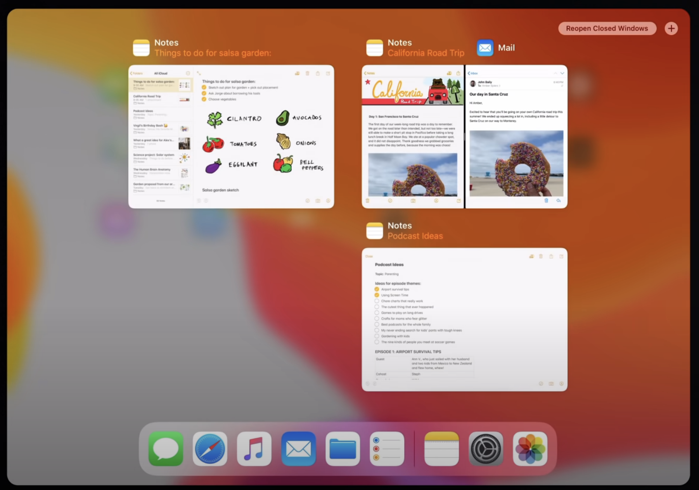
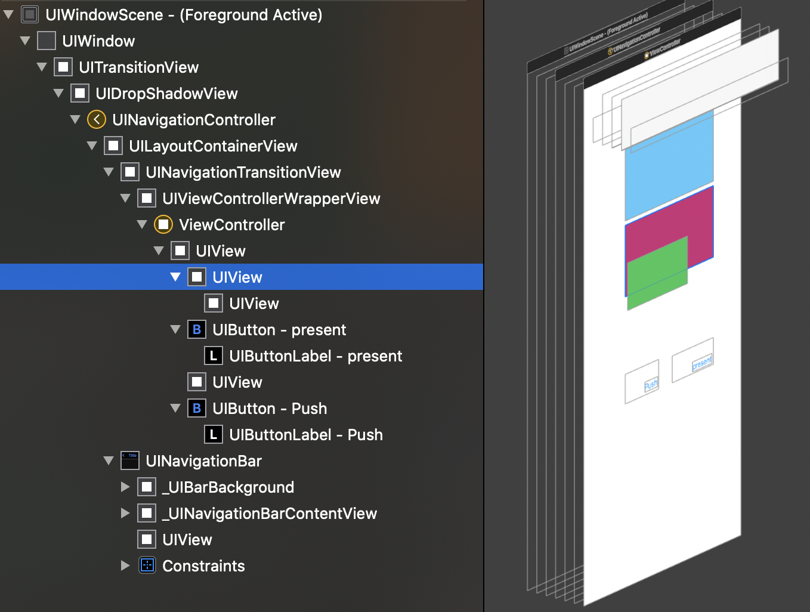
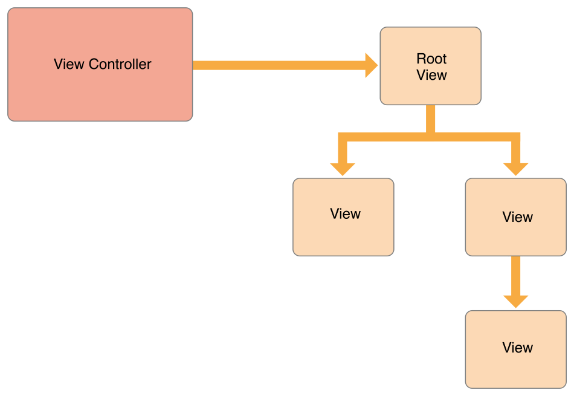
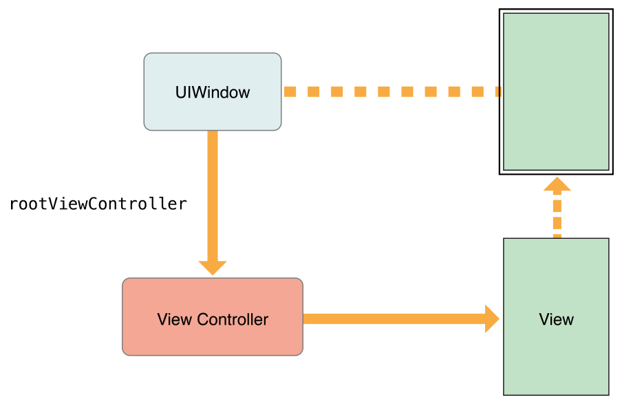
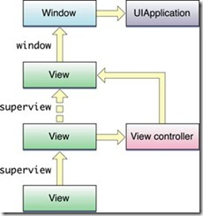
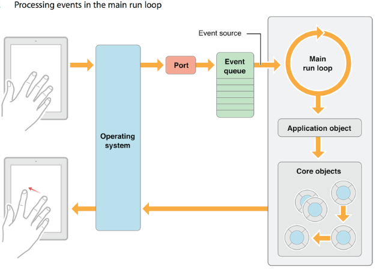

## 1. 应用启动

iOS底层实现是C语言，所以启动是由main函数开始的（C99规范），main函数里面调用UIApplicationMain传入AppDelegate类名，它是一个UIResponder的子类，并实现了UIApplicationDelegate协议.
```objc
int main(int argc, char * argv[]) {
    return UIApplicationMain(argc, argv, nil, NSStringFromClass([AppDelegate class]));
}
```

#### 1.1 UIResponder
处理和响应事件的基类, iOS应用中大部分组件都集成自它，包括普通的视图UIView, UIViewController, UIApplication, 输入框,列表页等。
iOS的事件封装对象是UIEvent，事件类型UIEventType包括了Touch、Motion(重力感应、摇一摇)、remoteControl(耳机控制)等，UIUIResponder包含了对这些事件的响应函数。
UIResponder还实现了UIResponderStandardEditActions协议，可以结合UIMenuController进行复制，粘贴等编辑操作.

```objc
// 比如对于Touch事件：
- (void)touchesBegan:(NSSet<UITouch *> *)touches withEvent:(nullable UIEvent *)event;
- (void)touchesMoved:(NSSet<UITouch *> *)touches withEvent:(nullable UIEvent *)event;
- (void)touchesEnded:(NSSet<UITouch *> *)touches withEvent:(nullable UIEvent *)event;
- (void)touchesCancelled:(NSSet<UITouch *> *)touches withEvent:(nullable UIEvent *)event;
```

**FirstResponder** : UIKit在分发事件的时候，会先把事件派发给isFirstResponder的对象。比如输入框UITextField可以调用becomeFirstResponder跟resignFirstResponder来呼起/关闭键盘.

**nextResponder** : 指向响应链的下一个responder（响应链下一节介绍）.

#### 1.2 UIApplication
是UIResponder的子类，应用启动的时候会创建一个UIApplication单例，可以通过sharedApplication访问。一个应用示例对应一个UIApplication对象，在应用内尝试创建新的实例会报错。
UIApplicationMain初始化UIApplication单例时会根据第三个参数传入的类名创建一个实例，并赋值给单例的delegate，准备完毕后回调didFinishLaunchingWithOptions告知应用启动完毕，给当前线程（主线程）开启runloop(循环)并开始接收分发事件。（runloop后续介绍）

通过application，我们可以获取当前应用各种信息，以及做一些应用层级的操作与设置。
- statusBarStyle: 状态栏样式.
- idleTimerDisabled: 屏幕常亮.
- networkActivityIndicatorVisible: 状态栏是否显示网络loading.
- openURL: 呼起其他应用（包括打电话、发短信、发邮件、打开网页、打开设置项等系统应用）.
- sendAction: 发送消息.（如果target为nil，那消息会先派发给firstResponder，利用这个我们可以通过[[UIApplication sharedApplication] sendAction:@selector(resignFirstResponder)to:nil from:nil forEvent:nil] 来关闭键盘输入）
- sendEvent: 事件分发的起始函数，如果我们想拦截某些事件获取事件的信息可以重写或者hook这个函数来实现. （事件分发跟hook后续介绍）
- delegate: 实现app活动过程各种事件的代理协议，下一节介绍.
除外还有通知、shortcut等相关的函数..

#### 1.3 protocol、UIApplicationDelegate、UIWindowSceneDelegate
**protocol**：协议。对于A、B两个类，如果我们把A公开的属性跟方法叫做正向接口，把B公开的叫反向接口，那么协议可以理解为抽象化的反向接口。
比如说A是剧场，B是艺人。我们把A的状态(比如演出即将开始、演出开始、演出中、观众喝彩、中场休息、演出结束等)作为剧场协议，那么不管年龄、性别、身高、一个人还是团体，只要满足剧场协议的对象，就能进场表演。当A告知演出即将开始时，B可以开始着装打扮，演出开始后登场表演，观众喝彩时候可以表示感谢等。
在iOS编程中，实现协议的对象称为代理，协议一般也以Delegate结尾.

**UIApplicationDelegate**：它定义了应用活动过程的各种事件或生命周期回调，比如应用启动/关闭，前后台切换，内存不足，处理其他应用OpenURL传过来的信息，处理通知信息等.
另外它还定义了一个window对象，用于用户界面展示。对于info.plist里面指定了storyboard的情况，框架会默认给window赋值。没有指定可视化文件的情况则需要我们自行创建，如下所示，先创建一个window, 然后设置程序的第一个页面rootViewController，最后设置为keyWindow并且可见。（UIWindow与ViewController下节介绍）
由此我们的程序的第一个页面便展示出来了，在rootViewController类文件编写程序代码即可。

```objc
- (BOOL)application:(UIApplication *)application didFinishLaunchingWithOptions:(NSDictionary *)launchOptions {
    self.window = [[UIWindow alloc] init];
    self.window.rootViewController = xxxViewController;
    [self.window makeKeyAndVisible];
}
```

**UIWindowSceneDelegate**：iOS13系统给iPad新增了多窗口能力，因此UIApplication新增了一个UIWindowScene管理各自场景的window，每个UIWindowScene可以单独管理自己的状态栏样式，
开启多窗口能力需要勾选Supports multiple windows，在Info.plist新增的Application Scene Manifest项指定Delegate Class Name。
同样的它也有对应的协议UIWindowSceneDelegate, 之前UIApplicationDelegate的实现需要移到UIWindowSceneDelegate对应的函数去，比如didFinishLaunchingWithOptions -> willConnectToSession;


#### 1.4 UIView、UIViewController、UIWindow


**UIView** ：负责管理屏幕的某一块矩形的内容，包括大小，颜色、布局、子view，动画、具体的渲染layer等，它继承自UIResponder，所以它能传递处理事件。
- CALayer: UIKit底层的QuartzCore框架的类，负责图像展示跟动画.
- 层级：view可以相互叠加组合，当最终只有在window上的view才会展示出来.
- 几何相关：frame（相对父视图的位置），bounds（自身位置），center（相对父视图）,sizeToFit(调用sizeThatFits以包含的内容为标准调整自身大小)
- 动画：animateWithDuration函数可以以动画的形式展示视图属性的变化过程，包括布局，透明度，颜色等。
- 视图绘制：当视图内容发生变化(大小、位置、动画、色值属性等)时，需要调用setNeedsDisplay，系统会在下一帧绘制的时候刷新所有需要重绘的视图。
- 子视图管理：addSubview、sendSubviewToBack、bringSubviewToFront..
- 点击响应：没有关闭用户交互且可见的情况下响应的是该区域内的事件，可以通过重载以下几个touches函数来处理点击事件。想处理自身范围外的事件可以通过重写hitTest函数实现，点击区域判定由这个函数决定。
  
        touchesBegan:withEvent:
        touchesMoved:withEvent:
        touchesEnded:withEvent:
        touchesCancelled:withEvent:

- 布局：后续介绍

**UIViewController** : 视图控制器, 是MVC设计模式中的控制器部分, 负责加载和处理这些视图，管理与这些视图的交互，并协调视图对其展示的数据内容的变更作出响应。
结合NavigationController控制画面的切换，与其他视图控制器对象协调处理app展示逻辑; 


- (void)loadView
- (void)viewDidLoad
- (void)viewWillAppear
- (void)viewWillLayoutSubviews
- (void)viewDidLayoutSubviews
- (void)viewDidAppear
- (void)viewWillDisappear
- (void)viewDidDisappear

**UIWindow** ：继承自UIView，UIApplicationDelegate协议定义了应用的第一个window，应用启动后rootViewController把自身的view加到window上去展示在屏幕上。
对于一个view来说，它必须有window才能展示，所以判断一个view是否展示，可以判断它的window属性是否为空，另外还有willMoveToWindow方法可以监听展示与否。
同样的，在支持多窗口的应用中，一个 UIWindow要显示出来，需要windowScene属性有值。
一个app可能会有多个window，根据UIWindowLevel高的排前面，当同一时间只会有一个keyWindow，non-keyWindow 与 keyWindow 都可以响应 UIEventTypeTouches， 但像 键盘输入事件 、 加速计事件 、远程控制事件（例：耳机按钮控制事件）以及 物理按键点击事件 都只会向 keyWindow 发送 Event。
输入控件编辑的时候，所在的window会被设置为keyWindow




## 2. 事件分发、响应链与手势
iOS的控件，从Window，到ViewController, View都是集成自UIResponder，事件的分发就是通过由控件树所构成的responder chain(响应链)所进行的。
举例来说，页面上一个自定义的UIView它的nextResponder是superView, 直到VC所持有的rootView，它跟superview直接多了一个VC作为nextResponder，
UINavigationController所持有的view也是一样，最终会传到 UIWindow，然后是UIWindowScene，UIApplication，AppDelegate，nil

当用户发起一个事件，比如触摸屏幕或者晃动设备，系统产生一个事件（UIEvent对象），传给UIApplication，而UIApplication则将这个事件传递给特定的UIWindow，然后由UIWindow通过Hit-Testing来找到点击的view，view将这个事件传递给特定的对象(即first responder)，它不处理就沿着响应链进行传递。

Hit-Testing是怎么确定点击的view？由hitTest方法结合pointInside结果进行判断;

```objc
- (nullable UIView *)hitTest:(CGPoint)point withEvent:(nullable UIEvent *)event;
- (BOOL)pointInside:(CGPoint)point withEvent:(nullable UIEvent *)event;
```
比如扩大按钮的响应访问可以这样实现
```objc
- (BOOL)pointInside:(CGPoint)point withEvent:(UIEvent *)event
{
    if (CGRectContainsPoint(CGRectInset(self.bounds, -20, -20), point)) {
        return YES;
    }
    return NO;
}
```


下图所示是一个典型的IOS事件传递响应链, 


## 3. runloop


 1. 保持线程持续运行，不会被销毁
 2. 处理App中各种事件（比如：触摸事件 ,定时器事件,Selector事件）
 3. 没有事件消息传入的时候休眠与来事件了唤醒，节省CPU资源
 4. 接收来源：输入源（input source）和定时源（timer source），需要指定runloop的一个或多个模式

eg：demo

## 4. 网络

iOS发起一个网络请求可以简单地用NSURLSession的dataTaskWithURL发起，如果需要加一下设置可以自行创建以下对象
```objc
    // 1. 创建一个网络请求，HTTPMethod默认GET
    NSURL *url= [NSURL URLWithString: @"https://mat1.gtimg.com/pingjs/ext2020/qqindex2018/dist/img/qq_logo_2x.png"];
    NSURLRequest *request = [[NSURLRequest alloc] initWithURL:url];

    // 2. 创建网络会话，可以通过自定义配置自行创建session (比如超超时时间)
    NSURLSession *session = [NSURLSession sharedSession];

    // 3. 通过session用req跟callback创建一个网络任务
    NSURLSessionDataTask *task= [session dataTaskWithRequest:request completionHandler:^(NSData * _Nullable data, NSURLResponse * _Nullable response, NSError * _Nullable error) {
        if (!error) {
            // ...
        }
    }];
    // 4. 开始任务
    [task resume];
```

AFN - 与多读串写


## 4. 

## 应用间通讯：openurl，plist, keychain


## task start


layout布局

AutoResizing 和 Constraint
当一个视图的大小改变时，它的子视图的位置和大小也需要相应地改变。UIView 支持自动布局，也可以手动对子视图进行布局。

当下列这些事件发生时，需要进行布局操作：

视图的 bounds 大小改变#
用户界面旋转，通常会导致根视图控制器的大小改变
视图的 layer 层的 Core Animation sublayers 发生改变
程序调用视图的setNeedsLayout或layoutIfNeeded方法
程序调用视图 layer 的setNeedsLayout方法
Auto Resizing
视图的autoresizesSubviews属性决定了在视图大小发生变化时，如何自动调节子视图。

可以使用的掩码如下：

UIViewAutoresizingNone
UIViewAutoresizingFlexibleHeight
UIViewAutoresizingFlexibleWidth
UIViewAutoresizingFlexibleLeftMargin
UIViewAutoresizingFlexibleRightMargin
UIViewAutoresizingFlexibleBottomMargin
UIViewAutoresizingFlexibleTopMargin
可以通过位运算符将它们组合起来，例如 UIViewAutoresizingFlexibleHeight|UIViewAutoresizingFlexibleWidth。

Constraint
Constraint 是另一种用于自动布局的方法。本质上，Constraint 就是对 UIView 之间两个属性的一个约束：

attribute1 == multiplier × attribute2 + constant
其中方程两边不一定是等于关系，也可以是大于等于之类的关系。

Constraint 比 AutoResizing 更加灵活和强大，可以实现复杂的子视图布局。

自定义 layout
UIView 当中提供了一个 layoutSubviews 函数，UIView 的子类可以重载这个函数，以实现更加复杂和精细的子 View 布局。

苹果文档专门强调了，应该只在上面提到的 Autoresizing 和 Constraint 机制不能实现所需要的效果时，才使用 layoutSubviews。而且，layoutSubviews 方法只能被系统触发调用，程序员不能手动直接调用该方法。

那么 layoutSubviews 方法具体调用的时机有哪些呢？在 stackoverflow 的这个答案里有所讨论，具体有下面几种情况：

在父 view 的 autoresize mask 为 ON 的情况下，addSubview 会导致被 add 的 view 调用 layoutSubviews, 同时 add 的 target view 以及它所有的子 view 都会被调用。
setFrame 当新的 frame 和 旧的不同时（即 view 的大小改变时）会调用 layoutSubviews
滚动一个 UIScollView 会导致这个 scrollView 以及它的父 View 调用 layoutSubviews
旋转设备会导致当前所响应的 ViewController 的主 View 调用 layoutSubviews
改变 View 的 size 会导致父 View 调用 layoutSubviews
removeFromSuperview 也会导致父 View 调用 layoutSubviews


开发模式

网络

多线程

异步绘制

内存优化

启动优化

block

KVO KVC